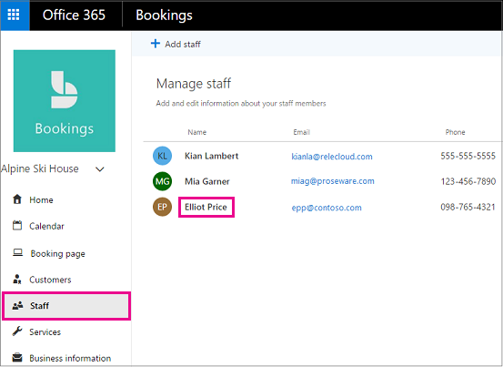
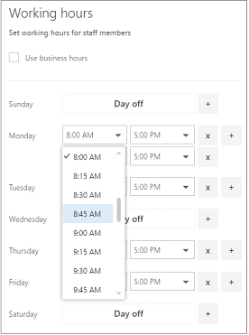
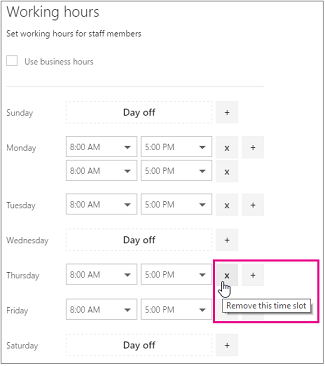

# Employee working hours in Microsoft Bookings

Setting employee working hours ensures that their availability is accurately shown when your customers try to book them. By default, the working hours for each of your employees match the business hours you've established in the Microsoft Bookings app. See the "Set your business hours" section of [Enter business information](enter-business-information.md#set-your-business-hours).

On the **Staff** page, you can customize employee working hours to match the needs of your business and employees.

If you want to book time off for staff members so customers can't book them while they're out of the office, see [Schedule business closures, time off, and vacation time](schedule-closures-time-off-vacation.md) for instructions.

## Customize employee working hours

Watch this video or follow the steps below to set an employee's working hours.

> [!VIDEO https://www.microsoft.com/videoplayer/embed/RWuXUq]

1. In Microsoft 365, select the app launcher, and then select **Bookings**.

1. In the navigation pane, select **Staff**, and then select the staff member whose hours you want to set.

   

1. Under Working hours, clear the **Use business hours** checkbox.

1. Use the dropdowns to select start and end times for each day. Times are available in 15-minute increments.

   

1. Click **+** to add start- and end-time selectors.

1. Select Save.

## Set an employee's days off

When you schedule a day off for an employee, that employee will appear unavailable on the booking page. Customers using the booking page will be unable to schedule him or her for service on that day.

1. On the working hours screen, select the **x** next to the day that the employee will have off.

   

1. If you want to schedule a day that was previously marked as a day off, select the **+** sign next to the day you want to schedule.

> [!TIP]
> If scheduling employee vacation time or other large blocks of time off, see the "Schedule employee time off" section of [Schedule business closures, time off, and vacation time](schedule-closures-time-off-vacation.md#schedule-employee-time-off).
