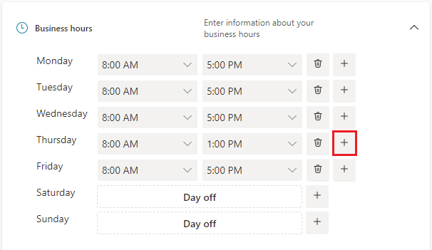
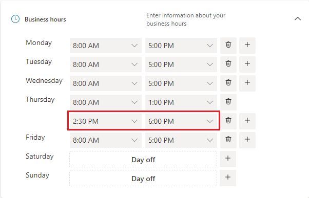
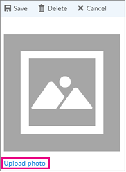

# Set up your shared booking page in Microsoft Bookings

Microsoft Bookings is a powerful scheduling tool that allows businesses to manage appointments with ease. One of the key features of Microsoft Bookings is the ability to set up shared bookings. This functionality enables multiple staff members to handle appointments, ensuring greater flexibility and efficiency in managing customer interactions. In this article, you'll learn about the four essential steps required to set up shared bookings in Microsoft Bookings.

## Steps to quickly create a shared booking page

On the home page of Bookings, navigate to the Shared Bookings section and select **Create booking page**. You can either create a booking page from scratch or clone an existing booking page. Select **Create from scratch** to create a new shared booking page.

1. Enter your business name, upload your business logo, and update your business hours. Note, business name is the only required field here. All the other details can be configured later from the Business Information page. This section is covered in detail in [Enter your business information in Microsoft Bookings](#enter-your-business-information-in-microsoft-bookings).

   :::image type="content" source="../media/create-shared-booking-page.png" alt-text="Screenshot showing step one out of four for creating a shared booking page in Microsoft Bookings" lightbox="../media/create-shared-booking-page.png":::

2. Invite staff - Add your team members in this section. These people will be able to view and manage bookings for the team based on the team roles assigned. You can choose to configure this later as well.

   :::image type="content" source="../media/booking-page-invite-staff.png" alt-text="Screenshot showing step two out of four for creating a shared booking page in Microsoft Bookings" lightbox="../media/booking-page-invite-staff.png":::

3. Add a service - You can add the list of services you wish to offer or customize the default service shown. You can choose to configure this later and proceed with the default service.

   :::image type="content" source="../media/booking-page-set-service.png" alt-text="Screenshot showing step three out of four for creating a shared booking page in Microsoft Bookings" lightbox="../media/booking-page-set-service.png":::

4. Choose who can book appointments - Decide the level of control you want to give to your customers for booking appointments from your booking page.

   :::image type="content" source="../media/booking-page-permissions.png" alt-text="Screenshot showing step four out of four for creating a shared booking page in Microsoft Bookings" lightbox="../media/booking-page-permissions.png":::

5. Select **Create** to finish setting up your booking page. If you quit at this stage, your progress will not be saved.

   :::image type="content" source="../media/booking-page-done.png" alt-text="Screenshot showing the loading screen for creating a shared booking page in Microsoft Bookings" lightbox="../media/booking-page-done.png":::

6. Once your shared booking page is set up, you can share it or configure it further. Select **Get Started** to tailor your shared booking page to meet your business requirements.

   :::image type="content" source="../media/booking-page-share.png" alt-text="Screenshot showing the option to share your shared booking page in Microsoft Bookings" lightbox="../media/booking-page-share.png":::

## Enter your business information in Microsoft Bookings

In Microsoft Bookings, the Business Information page contains all the details that you'd typically find on a business' "About us" page. These details include a relevant name, address, phone number, web site URL, privacy policy URL, logo, and business hours.

The information you provide here's displayed on the page customers and clients use to book appointments (known as the booking page) and in messages and reminders sent to them by Bookings.

> [!NOTE]
> To get started, see [Get access to Microsoft Bookings](get-access.md). To turn Bookings on or off, see [Turn Bookings on or off for your organization](turn-bookings-on-or-off.md).

## Provide business name and contact information

1. Once you have created a shared booking page, select **Business information** in the left pane.

1. On the **Basic details** section, enter your business name, address, and phone number you would like to use for your booking page.

    :::image type="content" source="../media/bookings-business-basic-details.png" alt-text="Screenshot: Page to enter your basic business information":::

    In **Send customer replies to**, type the preferred email address where email replies to booking confirmations and reminders should be forwarded.

    In the **Website URL** field, enter the URL of the home page for your business.

    Enter the **privacy policy** and **terms & conditions** URLs.

1. On the **Business logo** section, if you haven't already uploaded your business logo to the Bookings app, add your business logo.

1. On the **Set your business hours** section, set business hours to your operational hours. These are the hours to which all bookings are restricted. Other time restrictions of when appointments can be booked can be set for each service and for each staff member in the **Services** and **Staff** pages.

    On the Business information page, under Business hours, use the dropdowns to select start and end times for each day. Select **+** to add start- and end-time selectors.

    By default, the business hours in the Bookings app are set to 8 a.m. to 5 p.m., Monday through Friday. Times are provided in 15-minute increments. The Bookings app uses the 12-hour clock.

1. Select **Save**.

### How to set hours for a split shift

You might need to block out a portion of each day or week to have staff meetings, update inventory, or take care of other rhythm-of-business details. The Bookings app allows you to limit customer appointments to your specified time slots.

For example, you have staff meetings every Thursday from 1 o'clock to 2:30 and want to block out that time so all of your staff members can attend. To do block out time:

1. On the Business information page, under Business hours, select a start and end time for Thursdays. In this example, we set 8:00 a.m. to 1:00 p.m.

1. Select **+** to create a new row for Thursday.

   

1. In the new row, select 2:30 p.m. for the start time and 6:00 p.m. for the end time.

   

1. Select Save.

    When a customer goes to your booking page, they see that your business is closed from 1 to 2:30 on Thursdays.

## Upload your logo

If you haven't uploaded your business logo to the Bookings app, you can do it from the Business information page.

1. On the Business information page, under Upload logo, select **Change**.

1. Select **Upload photo**.

   

1. Select **Save**.
