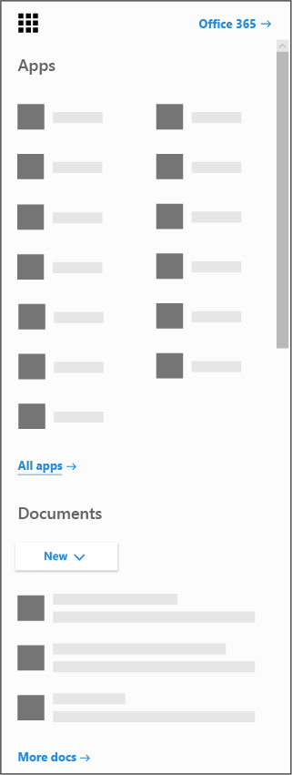

# Get the Microsoft Bookings app for iOS and Android

Microsoft Bookings is available as a mobile app for iOS and Android. The Bookings app for iOS is available in all regions and countries that Apple supports. You can download the app from the [iTunes App Store](https://apps.apple.com/app/microsoft-bookings/id1065657468). The Bookings app for Android is available for download from the [Google Play Store](https://play.google.com/store/apps/details?id=com.microsoft.exchange.bookings) in the US and Canada.

## Before you begin

Before getting started, you need to set up Bookings on the web.

1. From the app launcher, select All apps to see an alphabetical list of the Microsoft 365 apps available to you. From there, you can search for a specific app

   

2. Got to [the Office home page](https://office.com) and from the app launcher, select **Bookings**.

3. Select **Get it now**.

4. Provide the name and type of business or organization you own or run.

5. You're now ready to set up Bookings for your organization. Follow the steps in the [Microsoft Bookings](bookings-overview.md) topic to finish setting up Bookings.

## Download the Bookings app

Once you've set up the Bookings web app, go to your device's online store and download the Bookings app and sign in with your admin account.

## View-only mode

Any user who is not granted read-write access in Bookings can still use the mobile app in view-only mode. Anyone with a Bookings license who gets added to a booking calendar can see their own and their colleagues’ schedules, appointment details, and business information. A user with view-only access can't make changes or edits and cannot access the customer list.
