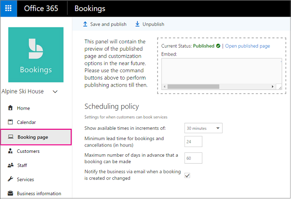

# Publish or unpublish your booking page

The booking page is the page on your web site where customers can schedule appointments with your business. This page is powered by Microsoft Bookings.

> [!NOTE]
> Bookings is turned on by default for customers who have the Microsoft 365 Business Standard, Microsoft 365 A3, or Microsoft 365 A5 subscriptions. Bookings is also available to customers who have Office 365 Enterprise E3 and Office 365 Enterprise E5, but it is turned off by default. To get started, see [Get access to Microsoft Bookings](get-access.md). To turn Bookings on or off, see [Turn Bookings on or off for your organization](turn-bookings-on-or-off.md).

## Publish the booking page

Use the booking page tab in the Microsoft Bookings app to publish and unpublish your booking page.

Watch this video or follow the steps below to publish or unpublish your booking page.

> [!VIDEO https://www.microsoft.com/videoplayer/embed/RWuYil]

1. In Microsoft 365, select the app launcher, and then select **Bookings**.

   

1. In the navigation pane, select **Booking page**.

   

1. Verify your scheduling policies are correct. See [Set your scheduling policies](set-scheduling-policies.md) for more information.

1. Select **Save and publish**. You'll see a confirmation message.

1. Select **Open published page** to see your page in a web browser.

## Unpublish the booking page

To unpublish the booking page, browse to the booking page and select **Unpublish**.