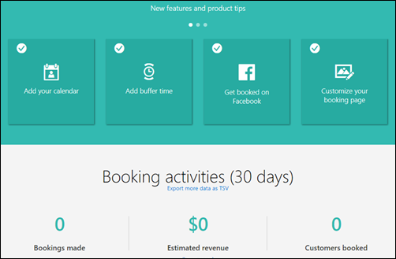

# Reporting information for Microsoft Bookings

You can see a 120 day view of your booking calendar and export this data to a TSV (tab-separated value) file. TSV files can viewed, edited, and manipulated with any text editor or spreadsheet program, such as Microsoft Excel.

## See 120 days of booking activity

1. On the booking calendar dashboard, under **Booking activities**, select **Export more data as TSV**.

   

1. Save the file with a new name. Specify `.xls` or `.xlsx` format.

1. Open the file in any text editor or spreadsheet program to view, edit, or graph the data.

The file contains a row for each event on the booking calendar for the previous 60 days and for the upcoming 60 days. Each row includes the date and time for the event, customer name, customer email, customer phone number, customer address, staff assigned, service selected, location, and appointment duration.
