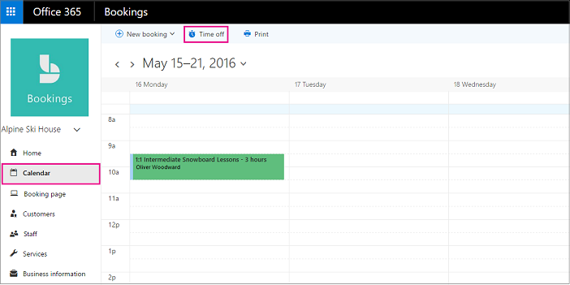
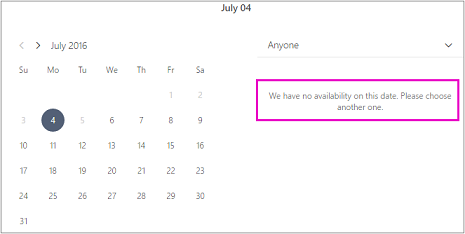
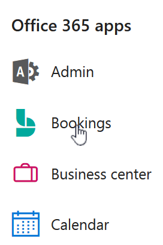

# Schedule business closures, time off, and vacation time

Occasionally, you'll want to close your business for holidays or team events, or your employees will need time off when they're sick, on vacation, or unavailable for other reasons. You can schedule time off from the Microsoft Bookings calendar, and the employee will be unavailable for bookings during the specified time. Once the business reopens or employees return to work, everyone will be listed on the booking page according to their established work hours.

> [!NOTE]
> Bookings is turned on by default for customers who have the Microsoft 365 Business Standard, Microsoft 365 A3, and Microsoft 365 A5 subscriptions. Bookings is also available to customers who have Office 365 Enterprise E3 and Office 365 Enterprise E5, but it is turned off by default. To get started, see [Get access to Microsoft Bookings](get-access.md). To turn Bookings on or off, see [Turn Bookings on or off for your organization](turn-bookings-on-or-off.md).

Watch this video or follow the steps below to schedule business closures or employee off.

**-**
**Remove XML below and insert video link**
**-**
<mediaLink>
	<image xlink:href="4873755a-8b1e-497e-bc54-101d1e75d3e7" />
	<video videoid="RE2TxDC" channel="ALTENUS_MS_OFFICE" videotype="single" player="ocvideo" />
</mediaLink>

## Schedule ad hoc business closures

1. In Microsoft 365, select the app launcher, and then select Bookings.

1. In the navigation pane, select **Calendar** \> **Time off**.

   

1. Fill in the details, including a title, start and end date and times, location, and additional notes.

1. Select **All day event**.

1. Select all staff members.

1. Select **Save**.

When a customer attempts to schedule service on a day the office is closed, they'll see a message on the booking page.

   

## Schedule employee time off

1. In Microsoft 365, select the app launcher, and then select **Bookings**.

   

1. In the navigation pane, select **Calendar** \> **Time off**.

   

1. Fill in the details, including a title, start and end date and times, location, and additional notes. If the employee will be gone for a full day or for several days, select **All day event**.

1. Select the staff member or members who are taking the time off.

1. Select **Save**.
