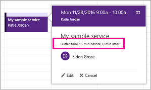

# Set buffer time in Microsoft Bookings

Some of your appointments might require time before or after you meet with your customer to set up, clean up, or reset your room and equipment. Or if you’re on the road between customer appointments, you may need time to ensure you and your team can travel between appointments without making the customer wait.

You can set buffer time before appointments start, after appointments end, or both to give staff the extra time they need to prepare for their next appointment.

## Set buffer time defaults

Buffer time defaults are set on the **Service details** page in Bookings. Like all service defaults set on this page, these defaults can be edited by you for a specific booking to meet specific customer needs.

The buffer time setting can be found just below the **Default duration** pickers on the **Service details** page. Before it can be set for a given service, you must enable the buffer time setting by selecting the buffer time toggle. This causes the **Before** and **After** drop-downs to appear, which are used to pick the default amount of time to hold before and after each booking, as shown here:

   

## Buffer time and appointment timing

To avoid confusion about when customers expect to meet with you, Bookings shows buffer time and actual appointment time (the time your customers expect to meet with you) on your calendar, and in email confirmations and reminders to relevant staff. For example, below is what you’d see in Bookings for an appointment with a customer that includes 15 minutes of pre-appointment buffer time.

Note that the event itself (on the left in the image below) shows lighter shading for the buffer time and darker shading for the actual customer appointment. The appointment call-out (which is opened when you select the event) specifically states that the appointment is from 9:00AM to 10:00AM with Katie Jordan and includes 15 minutes of buffer time before the appointment and 0 minutes after the appointment. Confirmations and reminders to staff similarly reference specific buffer and appointment time while the customer would only get confirmations and reminders that reference a 9:00AM to 10:00AM appointment time.

   

## Buffer time and availability

Your customers don’t directly see and cannot change the buffer times you set. However, because buffer time is used to calculate overall service duration, customers will see you and your relevant staff as booked during both buffer and regular appointment times. Customers also only see availability for you and your staff if there is enough time for both the appointment and its buffer time.

As an example, a one-hour appointment with a 15-minute pre-appointment buffer time requires an available time block of at least 1 hour and 15 minutes. An appointment for this service would therefore fill a 75-minute block of time on your calendar and needs 75 minutes of availability to book without conflict.
