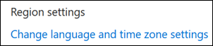

# Set language and time zones in Microsoft Bookings

If you are using Microsoft Bookings and bookings are created at the wrong time, then your time zone settings might need to be changed. Likewise, if some bookings are in the wrong language, you might need to change your language settings.

There are two separate language and time zone settings for Bookings. The first setting controls the language and time zone of the booking calendar and is set using the Outlook on the web settings for the personal calendar of the logged-in user. The second setting affects the self-service booking page that your customers use and is set using a "regional settings" page that controls language and time zone only for that page.

## Setting language and time zone for a booking calendar

The booking calendar uses the logged-in user’s language and time zone settings. For example, If the logged-in user’s time zone is set to Eastern Standard Time (EST), then the booking calendar will show existing appointment start and end times in EST. This time zone was originally set when the user’s Microsoft 365 and Outlook on the web accounts were created.

To set the language and time zone for the booking calendar:

1. Log into Microsoft 365 and select the Outlook tile on the landing page (as shown in the screenshot below) or in the Microsoft 365 App Launcher.

   :::image type="content" source="../media/bookings-outlook-tile.png" alt-text="Outlook tile on Microsoft 365 landing page.":::

1. After Outlook opens, select the **gear icon** in the upper, right-hand corner of the screen to open your personal and account settings, then search for “time zone” in the **Settings** panel search box. The panel will update to show your current personal language and time zone settings for this account. As noted above, this setting also controls the language and time zone of the booking calendar.

1. Change the language or time zone by selecting the drop-down arrow in the **Language or Current time zone** box and choosing the desired setting.

1. Click **Save**. The Settings panel closes, Outlook on the web restarts, and the new language and time zone settings are applied.

## Setting the language and time zone for the booking page

1. In Microsoft 365, select the app launcher, and then select **Bookings**.

1. In the navigation pane, select **Booking page** and select **Change language and time zone settings**.

   

1. Select your language and current time zone and choose **OK**.

   :::image type="content" source="../media/bookings-region-timezone-settings-1.png" alt-text="Language and time zone settings.":::
