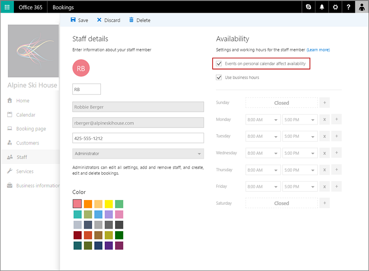

# Sync your staff's work calendar with Microsoft Bookings

You can optionally allow a staff member's work calendar to block their availability for appointments in Bookings.

When your staff member creates an appointment on their Microsoft 365 or Office 365 work calendar, it will block their availability in Bookings. Likewise, when a booking is made by a customer using the Bookings app and that customer is within your Microsoft 365 or Office 365 organization, that booking shows up as blocked on the customer's work calendar. Bookings does not show any personal information in the Bookings calendar and only shows that the time isn't available for appointments.

> [!NOTE]
> Bookings is turned on by default for customers who have the Microsoft 365 Business Standard, Microsoft 365 A3, or Microsoft 365 A5 subscriptions. Bookings is also available to customers who have Office 365 Enterprise E3 and Office 365 Enterprise E5, but it is turned off by default. To get started, see [Get access to Microsoft Bookings](get-access.md). To turn Bookings on or off, see [Turn Bookings on or off for your organization](turn-bookings-on-or-off.md).

## Sync work calendars to Bookings

You also must be the Bookings calendar admin to allow a user's Microsoft 365 or Office 365 work calendar to sync with Bookings. You must enable this for each staff member from the Staff page in Bookings.

You can only sync calendars for users who have a Microsoft 365 or Office 365 work account within your Microsoft 365 or Office 365 organization. You can't use an external calendar, such as Outlook.com.

1. From the Microsoft 365 app launcher, select **Bookings**.

1. Go to the **Staff** page.

1. Select the staff member whose calendar you want to sync with Bookings.

1. In the **Availability** section, select **Events on personal calendar affect availability**, and then select **Save**.

   
