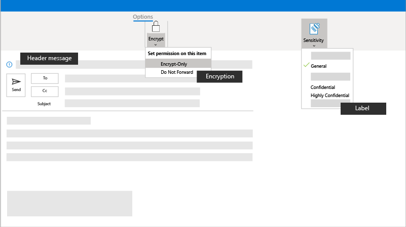

# Encrypt or label your sensitive email in Microsoft 365

Your data and information is important, and often, confidential. The objective here is to help protect this sensitive information by ensuring everyone is using sensitivity labels so that email recipients treat the information with the utmost sensitivity.

## Best practices

Before individuals send email with confidential or sensitive information, they should consider turning on:

- **Encryption:** You can encrypt your email to protect the privacy of the information in the email. When you encrypt an email message, it's converted from readable plain text into scrambled cypher text. Only the recipient who has the private key that matches the public key used to encrypt the message can decipher the message for reading. Any recipient without the corresponding private key, however, sees indecipherable text. Your admin can define rules to automatically encrypt messages that meet certain criteria. For instance, your admin can create a rule that encrypts all messages sent outside your organization or all messages that mention specific words or phrases. Any encryption rules will be applied automatically.

- **Sensitivity labels:** If your organization requires it, you can set up sensitivity labels that you apply to your files and email to keep them compliant with your organization's information protection policies. When you set a label, the label persists with your email, even when it's sent &mdash; for example, by appearing as a header to your message.

   

## Set it up

If you want to encrypt a message that doesn't meet a pre-defined rule or your admin hasn't set up any rules, you can apply a variety of different encryption rules before you send the message. To send an encrypted message from Outlook 2013 or 2016, or Outlook 2016 for Mac, select **Options > Permissions**, then select the protection option you need. You can also send an encrypted message by selecting the **Protect** button in Outlook on the web. For more information, see [Send, view, and reply to encrypted messages in Outlook for PC](https://support.microsoft.com/en-us/office/send-view-and-reply-to-encrypted-messages-in-outlook-for-pc-eaa43495-9bbb-4fca-922a-df90dee51980).

## Admin settings

You can learn all about setting up email encryption at [Email encryption in Microsoft 365](../compliance/email-encryption.md).

### Automatically encrypt email messages

Admins can create mail flow rules to automatically protect email messages that are sent and received from a campaign or business. Set up rules to encrypt any outgoing email messages, and remove encryption from encrypted messages coming from inside your organization or from replies to encrypted messages sent from your organization.

You create mail flow rules to encrypt email messages with Microsoft Purview Message Encryption. Define mail flow rules for triggering message encryption by using the <a href="https://go.microsoft.com/fwlink/p/?linkid=2059104" target="_blank">Exchange admin center (EAC)</a>.

1. In a web browser, using a work or school account that has been granted global administrator permissions, sign in.
2. Choose the Admin tile.
3. In the Admin center, choose **Admin centers > Exchange**.

For more information, see [Define mail flow rules to encrypt email messages](../compliance/define-mail-flow-rules-to-encrypt-email.md).

### Brand your encryption messages

You can also apply branding to customize the look and the text in the email messages. For more information, see [Add your organization's brand to your encrypted messages](../compliance/email-encryption.md).

## Next mission

If you've gotten this far, you've successfully completed another mission, so congratulations! There's no time to rest on our successes, so let's get right to setting up a safe and secure environment in which the team can [collaborate safely](m365bp-collaborate-share-securely.md).