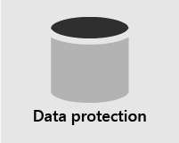
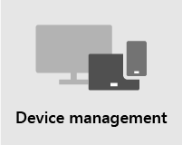

# Overview of security

> [!VIDEO https://www.microsoft.com/videoplayer/embed/RE4mzxI?autoplay=false]

Microsoft 365 Business Premium provides threat protection, data protection, and device management features to help you protect your company from online threats and unauthorized access, as well as protect and manage company data on your phones, tablets, and computers.

| [Threat protection](#threat-protection)|  [Data protection](#data-protection) |   [Device management](#device-management) |
|--|--|--|

## Threat protection

Microsoft 365 Business Premium includes [Office 365 Advanced Threat Protection (ATP)](safe-links.md), a cloud-based email filtering service that protects you from malware, ransomware, harmful links, and more. ATP Safe Links protects you from malicious URLs in email or Office documents. ATP Safe Attachments protects you from malware and viruses attached to messages or documents.

[Multi-factor authentication (MFA)](turn-on-mfa.md), or two-step verification, requires you to present a second form of authentication, such as a verification code, to confirm your identity before you can access resources.  

[Windows Defender](https://docs.microsoft.com/windows/security/threat-protection/overview-of-threat-mitigations-in-windows-10) provides comprehensive protection for your system, files, and online activities from viruses, malware, spyware, and other threats.

## Data protection

Data protection features in Microsoft 365 Business Premium help ensure that important data stays secure and only authorized people have access to it.

You can use [data loss prevention (DLP)](set-up-dlp.md) policies to identify and manage sensitive information, such as Social Security or credit card numbers, so that it isn't mistakenly shared. 

[Office 365 Message Encryption](https://docs.microsoft.com/microsoft-365/compliance/ome?view=o365-worldwide) combines encryption and access rights capabilities to help ensure that only intended recipients can view message content. Office 365 Message Encryption works with Outlook.com, Yahoo!, and Gmail, and other email services.

[Exchange Online Archiving](https://docs.microsoft.com/office365/servicedescriptions/exchange-online-archiving-service-description/exchange-online-archiving-service-description) is a cloud-based archiving solution that works with Microsoft Exchange or Exchange Online to provide advanced archiving capabilities, including holds and data redundancy. You can use retention policies to help your organization reduce the liabilities associated with email and other communications. If your company is required to retain communications related to litigation, you can use In-Place Holds and Litigation Holds to preserve related email.

## Device management

Microsoft 365 Business Premium advanced device management features let you monitor and control what users can do with enrolled devices. These features include conditional access, [Mobile Device Management (MDM)](https://docs.microsoft.com/microsoft-365/admin/basic-mobility-security/manage-enrolled-devices?view=o365-worldwide), BitLocker, and automatic updates.

You can use conditional access policies to require additional security measures for certain users and tasks. For example, you can require multi-factor authentication (MFA) or block clients that don't support conditional access.

With MDM, you can help secure and manage your users' mobile devices like iPhones, iPads, Androids, and Windows phones. You can create and manage device security policies, remotely wipe a device to remove all company data, reset a device to factory settings, and view detailed device reports. 

You can enable BitLocker encryption to help protect data in case a device is lost or stolen, and enable Windows Exploit Guard to provide advanced protection against ransomware.

You can configure automatic updates so that the latest security features and updates are applied to all user devices. 

## Recommended security guidance

If you have Microsoft Business Premium, the quickest way to setup security and begin collaborating safely is to follow the guidance in this library: [Microsoft 365 for smaller businesses and campaigns](../campaigns/index.md). This guidance was developed in partnership with the Microsoft Defending Democracy team to protect all small business customers against cyber threats launched by sophisticated hackers.