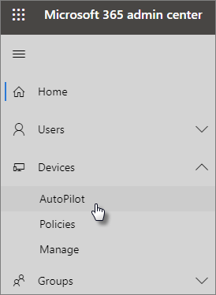

# Use the step-by-step guide to add Autopilot devices and profile

You can use Windows AutoPilot to set up **new** Windows 10 devices for your business so they are ready for productive use as soon as you give them to your employees.
  
## Device requirements

Devices need to meet these requirements:
  
- Windows 10, version 1703 or later.
    
- New devices that have not been through Windows out-of-box experience.
    
## Use the setup guide to create devices and profiles

If you have no device groups or profiles created yet, the best way to get started is by using the step-by-step guide, but you can also [add devices](create-and-edit-autopilot-devices.md) and [assign profiles](create-and-edit-autopilot-profiles.md) to them without using the guide. 
  
1. Go to the admin center at <a href="https://go.microsoft.com/fwlink/p/?linkid=837890" target="_blank">https://admin.microsoft.com</a>.

2. On the left nav choose **Devices** \> **AutoPilot**.

    
  
2. On the **AutoPilot** page, click or tap **Start guide**.
    
    
  
3. On the **Upload .csv file with list of devices** page, browse to a locations where you have the prepared .CSV file, then **Open** \> **Next**. The file should have three headers:
    
  - Column A: Device Serial Number
    
  - Column B: Windows Product ID
    
  - Column C: Hardware Hash
    
    You can get this information from your hardware vendor, or you can use the [Get-WindowsAutoPilotInfo PowerShell script](https://www.powershellgallery.com/packages/Get-WindowsAutoPilotInfo) that will generate a CSV file. 
    
    For more information, see [Device list CSV-file](https://support.office.com/article/932e3676-2491-49f0-9177-d893d2f5276e). You can also download a sample file on the **Upload .csv file with list of devices** page. 
    
4. On the **Assign a profile** page, you can either pick an existing profile, or create a new one. If you don't have one yet, you will be prompted to create a new one. 
    
    A profile is a collection of settings that can be applied to a single device or to a group of devices.
    
    The default features are required and will be set automatically. The default features are:
    
  - Cortana, OneDrive and OEM registration is skipped.
    
  - Create sign-in experience with your company brand.
    
  - Your devices are going to be connected to Azure Active Directory accounts and automatically enrolled to be managed by Microsoft 365 Business.
    
    For more information, see
    
    [About AutoPilot Profile settings](autopilot-profile-settings.md) . 
    
5. The other settings are **Skip privacy settings** and **Don't allow user to become the local admin**. These are both set to **Off** by default. 
    
    Choose **Next**.
    
6. **You're done** page indicates that the profile you created (or chose) will be applied to the device group you created by uploading the list of devices. These settings will be in effect when the device users sign in next. Choose **Close**.
    