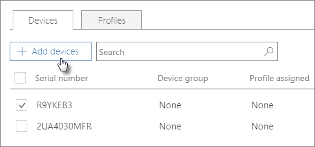

# Create and edit AutoPilot devices

## Upload a list of devices

You can use the [Step-by-step guide](add-autopilot-devices-and-profile.md) to upload devices, but you can also upload devices in the **Devices** tab. 
  
Devices must meet these requirements:
  
- Windows 10, version 1703 or later
    
- New devices that haven't been through Windows out-of-box experience

1. In the Microsoft 365 admin center, choose **Devices** \> **AutoPilot**.
  
2. On the **AutoPilot** page, choose the **Devices** tab \> **Add devices**.
    
    
  
3. On the **Add devices** panel, browse to a [Device list CSV file](../admin/misc/device-list.md) that you prepared \> **Save** \> **Close**.
    
    You can get this information from your hardware vendor, or you can use the [Get-WindowsAutoPilotInfo PowerShell script](https://www.powershellgallery.com/packages/Get-WindowsAutoPilotInfo) to generate a CSV file. 
    
## Assign a profile to a device or a group of devices

1. On the **Prepare Windows** page, choose the **Devices** tab, and select the check box next to one or more devices. 
    
2. On the **Device** panel, select a profile from the **Assigned profile** drop-down. 
    
    If you don't have any profiles yet, see [Create and edit AutoPilot profiles](create-and-edit-autopilot-profiles.md) for instructions. 
