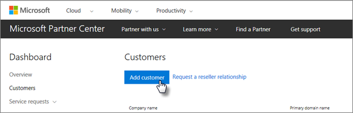

# Get Microsoft 365 Business Premium

## Get Microsoft 365 Business Premium from Microsoft

If you don't have a partner and want to get Microsoft 365 Business Premium, you can [buy it here](https://www.microsoft.com/microsoft-365/business).

See [sign up for Microsoft 365 Business Premium](sign-up.md) for detailed instructions.

You can also head over to a [Microsoft Store](https://www.microsoft.com/store/locations/find-a-store?icid=en_US_Store_UH_FAS) to buy Microsoft 365 Business Premium and get setup help.
  
## Get Microsoft 365 Business Premium from Microsoft Partner Center

1. Sign in at [Microsoft Partner Center](https://go.microsoft.com/fwlink/p/?linkid=849910) by using the credentials you created when you enrolled to the Cloud Service Provider (CSP) program. 
    
2. On the Partner Dashboard, choose **Customers**, then select your customer or add a new customer before you get Microsoft 365 Business Premium.
    
    
  
3. On the customer's **Subscription** page, select **Add subscription**, choose the Small business option under Catalog, and then choose **Microsoft 365 Business Premium**.
    
    Select the number of licenses you need (up to 300). If you have more than 300 users, see [Microsoft 365 Enterprise](../enterprise/index.yml) instead. 
    
    
  
    Complete the rest of the steps for adding a new customer, including the business name.
