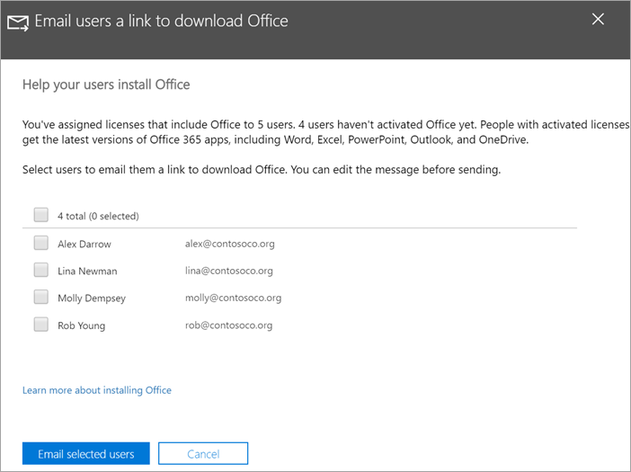

# Help your users install Office on Windows 10 devices

You can quickly and easily install Office on Windows 10 PCs from the Microsoft 365 admin center.
  
To understand how this works with previously installed Office apps, read [Prepare for Office client installation](prepare-for-office-client-deployment.md) before you get started.

Watch a short video about installing Office apps.  

> [!VIDEO https://www.microsoft.com/videoplayer/embed/acce002c-0756-4b64-ac5d-2198ee96a9b1] 

If you found this video helpful, check out the [complete training series for small businesses and those new to Microsoft 365](../business-video/index.yml).

## Manage Office deployments

1. Go to the admin center at <a href="https://go.microsoft.com/fwlink/p/?linkid=2024339" target="_blank">https://admin.microsoft.com</a>, and sign in with global admin credentials. 

2. Go to **Setup** in the left navigation pane, and on the **Setup** page, scroll to **Apps and updates**.
    > [!NOTE]
    > You might not see this card if all of your  users have installed Office apps.
  
3. On the **Help users install their Office apps** card, choose **View**, and then **Get started**.
    
4. On the **Email users a link to download Office** panel, select the users you want to email, and then **Email selected users**.

   

## For more on setting up and using Microsoft 365 Business Premium

[Microsoft 365 for business training videos](../business-video/index.yml)