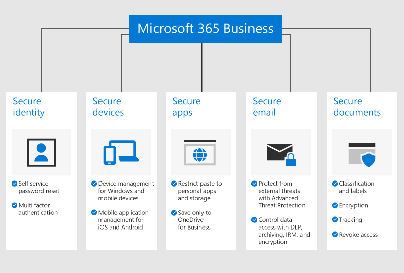

# Overview of Microsoft 365 Business

## What is Microsoft 365 Business

Microsoft 365 Business is a comprehensive set of business productivity and collaboration tools, such as Outlook, Word, Excel, and other Office products that are always up to date. You can protect your work files on all of your iOS, Android, and Windows 10 devices with enterprise-grade security that is simple to manage.
  
Microsoft 365 Business is meant for up to 300 licenses, if you need more licenses, see [Microsoft 365 Enterprise](https://go.microsoft.com/fwlink/p/?linkid=860986) documentation for more information.

See [Microsoft 365 Business service description](https://docs.microsoft.com/office365/servicedescriptions/microsoft-365-service-descriptions/microsoft-365-business-service-description) for the entire list of features.
  
## Small business security needs

Your business data can be compromised in many ways. You and your users can compromise your organization's security when you sign in with compromised credentials or view organization data on different devices and applications. More specifically, your organization is at risk from:

1. Compromised or weak sign-in credentials.
2. Compromised device with a weak pin, or a user owned device.
3. Users who can copy/paste/save your organization's data to personal apps​.
4. Users who install and use 3rd party apps with weak security​.
5. Email vulnerabilities including sharing sensitive data, phishing attempts, malware, etc.
6. When people who should not, can access documents with sensitive information.

Microsoft 365 Business helps safeguard your data in each of these instances. The security features that protect your business data are detailed in the following figure.

To see the full list of security features, see [Microsoft 365 Business security features](security-features.md). After you [Set up Microsoft 365 Business](set-up.md), see [Set up advanced security policies](set-up-advanced-security.md) to get started with the security features that are not included as a part of the setup. Read also [Top 10 ways to secure Office 365 and Microsoft 365 Business plans](https://docs.microsoft.com/office365/admin/security-and-compliance/secure-your-business-data) for a good overview on how to set up protections against cyber criminals and hackers.

## Get Microsoft 365 Business

- If you have a partner, they will get Microsoft 365 Business: [Get Microsoft 365 Business from Microsoft Partner Center](get-microsoft-365-business.md#get-microsoft-365-business-from-microsoft-partner-center).

- If you don't have a partner and want to get Microsoft 365 Business, you can [buy it here](https://www.microsoft.com/microsoft-365/business) and follow the [sign up](sign-up.md) instructions.

- You can also head over to a [Microsoft Store](https://www.microsoft.com/en-us/store/locations/find-a-store?icid=en-us_UF_FAS) to both buy Microsoft 365 Business and get set-up help.
