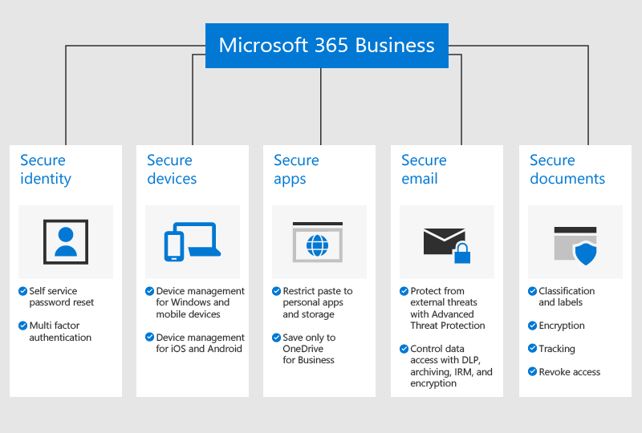

# Overview of Microsoft 365 Business Premium

## What is Microsoft 365 Business Premium

Microsoft 365 Business Premium (formerly Microsoft 365 Business) is a comprehensive subscription service for businesses with less than 300 employees. It integrates your favorite Office productivity apps and services, and collaboration tools like Microsoft Teams, with advanced security and device management capabilities.

Watch this video for a quick overview of Microsoft 365 Business Premium.  

> [!VIDEO https://www.microsoft.com/videoplayer/embed/RE2mhaA] 
  
If you found this video helpful, check out the [complete training series for small businesses and those new to Microsoft 365](../business-video/index.yml). 

Microsoft 365 Business Premium is meant for up to 300 licenses. If you need more licenses, see [Microsoft 365 Enterprise](../enterprise/index.yml) documentation for more information.

See the [Microsoft 365 Business Premium service description](/office365/servicedescriptions/microsoft-365-service-descriptions/microsoft-365-business-service-description) for the entire list of features.
  
## Small business security needs

Your business data can be compromised in many ways. You and your users can compromise your organization's security when you sign in with compromised credentials or view organization data on different devices and applications. More specifically, your organization is at risk from:

- Compromised or weak sign-in credentials.
- Compromised device with a weak pin, or a user owned device.
- Users who can copy/paste/save your organization's data to personal apps​.
- Users who install and use third-party apps with weak security​.
- Email vulnerabilities, including sharing sensitive data, phishing attempts, malware, and so on.
- When people who should not, can access documents with sensitive information.

Microsoft 365 Business Premium helps safeguard your data in each of these instances. The security features that protect your business data are detailed in the following figure.

## How your data and devices are protected

Microsoft 365 Business Premium helps **defended against threats** by:

- Scanning links in emails and documents in real time to block unsafe web sites (Safe Links).

- Performing advanced analysis of email attachments in a sandbox environment to detect newly developed malware (Safe Attachments). 

- Enabling anti-phishing policies that use machine learning models and impersonation detection to provide protection against advanced attacks (Anti-phishing in Defender for Office 365 intelligence). 

- Setting up advanced policies that disable access from untrusted locations or bypass multifactor authentication from trusted places such as your office network (Azure MFA including trusted IPs, and Conditional Access). 

- Enforcing malware protection across all your organization's Windows 10 devices and protecting files in key system folders from changes made by ransomware (Windows Defender)

Your **business data is protected** by:

- Using automatic detection to help prevent sensitive information such as Social Security numbers or credit cards from leaking outside your business (data loss prevention). 

- Encrypting sensitive emails so you can communicate securely with customers or other people outside your organization. This ensures that only the intended recipient can read the message (Office 365 Message Encryption).

- Controlling who has access to company information by applying restrictions such as **Do Not Copy** and **Do Not Forward** to email and documents (Azure Information Protection, Plan 1).

- Enabling unlimited cloud archiving so you can retain all your organization's email, including the mailboxes of former employees (Exchange Online Archiving).

Your **devices are secured** by:

- Controlling which devices and users can access your Microsoft data, with options to block users from signing in from home computers, unapproved apps, or outside of work hours (Conditional Access).

- Applying security policies to protect business data on iOS and Android devices. For example, you can require users to provide a PIN or fingerprint to access business data, and encrypt data on mobile devices (App protection for Office mobile apps).

- Keeping business documents, emails, and other data within approved Office mobile apps and preventing employees from saving these to unauthorized apps and locations (App protection for Office mobile apps).

- Remotely wiping business data from lost or stolen devices without affecting personal information (Intune selective wipe).

- Using simplified controls to manage policies for all the Windows 10 PCs in your company, enforcing BitLocker encryption and automatically installing critical Windows updates (Enforce Windows update policies).

To see the full list of security features, see [Microsoft 365 Business Premium security features](security-features.md). After you [Set up Microsoft 365 Business Premium](set-up.md), see [increase threat protection](increase-threat-protection.md) and [set up compliance features](set-up-compliance.md) to get started with the security features that aren't included as a part of the guided setup. Read also [Top 10 ways to secure Office 365 and Microsoft 365 Business Premium plans](/office365/admin/security-and-compliance/secure-your-business-data) for a good overview on how to set up protections against cyber criminals and hackers.

## Get Microsoft 365 Business Premium

- If you have a partner, they'll get Microsoft 365 Business Premium: [Get Microsoft 365 Business Premium from Microsoft Partner Center](get-microsoft-365-business.md).

- If you don't have a partner and want to get Microsoft 365 Business Premium, you can [buy it here](https://www.microsoft.com/microsoft-365/business) and follow the [sign up](sign-up.md) instructions.

## Related content

[Microsoft 365 Business Premium training videos](../business-video/index.yml) (link page)