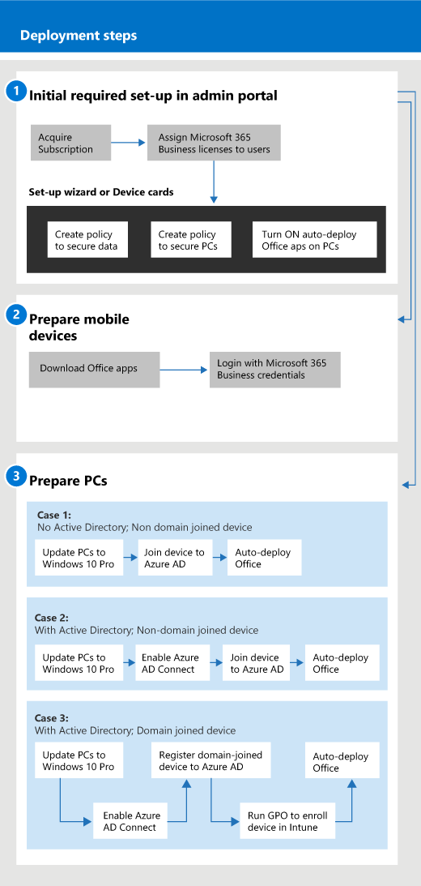

# Get started with Microsoft 365 for business

## What is Microsoft 365 Business

Microsoft 365 Business is a comprehensive set of business productivity and collaboration tools, such as Outlook, Word, Excel, and other Office products, that are always up to date. You can protect your work files on all your iOS, Android, and Windows 10 devices with enterprise-grade security that is simple to manage.

Watch this video for a quick overview of Microsoft 365 Business.  

> [!VIDEO https://www.microsoft.com/videoplayer/embed/RE2mhaA] 
  
Microsoft 365 Business is meant for up to 300 licenses. If you need more licenses, see [Microsoft 365 Enterprise](https://go.microsoft.com/fwlink/p/?linkid=860986) documentation for more information. 
  
## Get Microsoft 365 Business

- If you have a partner, they'll get Microsoft 365 Business: [Get Microsoft 365 Business from Microsoft Partner Center](get-microsoft-365-business.md).
    
- If you don't have a partner and want to get Microsoft 365 Business, you can [buy it here](https://www.microsoft.com/microsoft-365/business).
    
## Set up Microsoft 365 Business

 **Overview of Microsoft 365 Business Suite set up**
  
The following diagram describes how admins set up Microsoft 365 Business. It also describes the steps to prepare Windows PCs for Microsoft 365 Business. You can also add new devices in the Microsoft 365 admin center with [Windows AutoPilot](add-autopilot-devices-and-profile.md). You can use AutoPilot to set up and pre-configure new devices so that they're ready for productive use as soon as a user signs in with their Microsoft 365 Business credentials.
  

Watch this video for an overview of Microsoft 365 Business setup.  

> [!VIDEO https://www.microsoft.com/videoplayer/embed/RE1FYSM] 

If you found this video helpful, check out the [complete training series for small businesses and those new to Microsoft 365](https://support.office.com/article/6ab4bbcd-79cf-4000-a0bd-d42ce4d12816).

  
### 1: Set up Microsoft 365 Business (Admin)

Sign in to [Microsoft 365 admin center](https://portal.office.com/adminportal/home) with your global admin credentials, and complete the following steps to set up Microsoft 365 Business. 
  
1. [Prerequisites for protecting data on devices with Microsoft 365 Business](pre-requisites-for-data-protection.md)
    
    Read the prerequisites first to make sure that your devices are ready for Microsoft 365 Business.
    
2. [Use the setup wizard to set up Microsoft 365 Business](set-up.md)
    
    If you're **permanently moving from a local Active Directory to the cloud**, you can go to the Microsoft 365 admin center and use the setup wizard to add your users manually, or you can do a one-time sync with Azure AD Connect. There are two ways to do this: 
    
    - If you also have an Exchange 2010, Exchange 2013, or Exchange 2016 server, you can [Use Minimal Hybrid to quickly migrate Exchange mailboxes to Office 365](https://support.office.com/article/fdecceed-0702-4af3-85be-f2a0013937ef). The minimal hybrid steps include a one-time sync of users to Azure AD, and email migration from on-premises to the cloud. After the email migration is complete, the directory synchronization is automatically turned off when you use this method.
    
    - Use the Office 365 directory sync wizard to synchronize your users to the cloud. Follow the steps in [Set up directory synchronization for Office 365](https://support.office.com/article/1b3b5318-6977-42ed-b5c7-96fa74b08846) to complete this process. After you synchronize your users to the cloud, you'll have to [Turn off directory synchronization for Office 365](https://support.office.com/article/ee5f861e-bd48-4267-83d1-a4ead4b4a00d).
    
    You'll also have to give each user that was added this way a license to Microsoft 365 Business. You can do this in the [setup wizard](set-up.md) or you can [Assign licenses to users in Office 365 for business](https://support.office.com/article/997596B5-4173-4627-B915-36ABAC6786DC).
    
### 2: Prepare mobile devices

Follow the steps in [Set up mobile devices for Microsoft 365 Business users](set-up-mobile-devices.md) to install Office apps on devices and make sure they're protected by Microsoft 365 Business. 
  
### 3: Prepare PCs

Admins can pre-select settings for new Windows 10 PCs by using [Windows AutoPilot](add-autopilot-devices-and-profile.md). Users can set up their existing or new Windows 10 devices by following the steps in this topic: [Set up Windows PCs for Microsoft 365 Business users](set-up-windows-devices.md). For existing devices, users can **optionally** [move files to OneDrive for Business](move-files-to-onedrive.md). They can also use third-party tools to move files associated with Windows profile to OneDrive.
  
If your organization uses Windows Server Active Directory on-premises, you can set up Microsoft 365 Business to protect your Windows 10 devices, while still maintaining access to on-premises resources that require local authentication. Follow the steps in [Enable domain-joined Windows 10 devices to be managed by Microsoft 365 Business](manage-windows-devices.md) to set this up. This method is preferred, and devices in this state are called **Hybrid Azure AD joined devices**. 
  
If you retain a local Active Directory that contains some on-premises resources (such as file shares and printers), you can give your **Azure AD-joined devices** access to these resources by following the steps here: [Access on-premises resources from an Azure AD-joined device in Microsoft 365 Business](access-resources.md).
  
  
## Contact support

 **If you need to contact support:**
  
- Contact your partner.
    
- As a Microsoft 365 Business admin, you have access to our customer support team: **[Contact support for business products - Admin Help](https://support.office.com/article/32a17ca7-6fa0-4870-8a8d-e25ba4ccfd4b)**
    
## See also

[Microsoft 365 for business documentation and resources](https://go.microsoft.com/fwlink/p/?linkid=853701)
  
[Manage Microsoft 365 for business](manage.md)[Migrate to Microsoft 365 Business](migrate-to-microsoft-365-business.md)

[Microsoft 365 for business training videos](https://support.office.com/article/6ab4bbcd-79cf-4000-a0bd-d42ce4d12816) 
