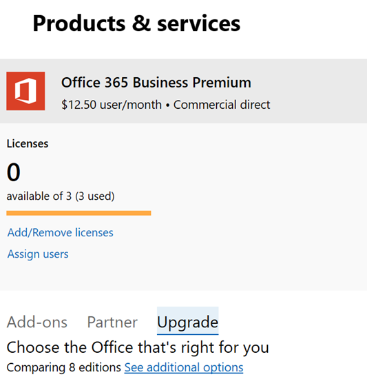

# Upgrade to Microsoft 365 Business from Office 365 Business Premium

If you have an [Office 365 for business subscription](https://products.office.com/compare-all-microsoft-office-products-4-column?activetab=tab:primaryr2), for example, Office 365 Business Premium, you can easily upgrade to Microsoft 365 Business. Upgrade to Microsoft 365 Business if you want to add: 
- Windows 10 Pro (to PCs running Windows 8 or later)
- Simple controls that manage business data on devices
- Advanced security capabilities.
Find out more about Microsoft 365 Business at [Microsoft.com](https://www.microsoft.com/microsoft-365/business)

## What's the difference between Office 365 Business Premium and Microsoft 365 Business?
We've added a side-by-side comparison of these two plans to the [Microsoft 365 Business service description](https://docs.microsoft.com/office365/servicedescriptions/microsoft-365-service-descriptions/microsoft-365-business-service-description). 

1. Once you have purchased new licenses, and this is the first time you did, the setup banner for Microsoft 365 Business will display on top of the admin center.
    
    > [!NOTE]
    > The setup banner is an opportunity to add new users, a new domain, and migrate email for new users. If you don't plan to do any, you should still go through the wizard and choose default options to make it disappear from the admin home page. 
  
   
  
    Choose **Start setup**.
    
2. On the **Personalize your sign-in and email** page, you can add a domain by choosing **Connect a domain you already own** if you want to use this opportunity to add another domain to your subscription. 
    
    If you have already set up a domain, the second field will indicate that and will say **Continue using** \<  _your domain name_\> **for email and signing in**. If you haven't set up a domain with you subscription, it will say **Continue using** \<  _your company name.onmicrosoft.com_\> **for email and signing in**.
    
    Choose **Next**.
    
    
  
3. On the **Add new users** page, you can add new users, if you have new employees that you want to assign the Microsoft 365 Business licenses to. 
    
    If you don't have new employees to add and want to assign licences to existing users, choose **Next**.
    
4. On the **Migrate email messages** page you can choose to migrate email for any of the new users you added in step 3. You can skip this step also. Choose **Next**.
    
5. On the last page, choose **go to the admin center**, and continue setup there.
    
6. In the admin center, go to **Users** \> **Active users**.
    
7. Select the user to whom you want to assign the **Microsoft 365 Business** license to, and then choose **Edit** next to **Product Licenses**.
    
    
  
## Before you get started

- **When should I choose upgrade?** Upgrade is the right choice when you want to upgrade **all users** assigned to a single plan. When you choose upgrade, all plan users get switched to another plan at the same time. If you don't want to upgrade everyone assigned to a single plan, buy licenses for the new plan (in this case Microsoft 365 Business), and [assign those licenses individually](https://docs.microsoft.com/office365/admin/manage/assign-licenses-to-users) to each user that you want to upgrade. 
- **Some add-ons might prevent upgrade** If you try to start an upgrade and you have an add-on that prevents you from continuing, you can remove the add-on first, and then add it back later - if you still need it. 
- **If you prepaid your plan** There isn't a straightforward upgrade path for prepaid plans. You'll know if you have a prepaid plan because you set up your plan using a product ID that you might have purchased in a store. Contact a partner, go to the Microsoft store, or wait until your prepaid plan expires to switch to a new plan.

## Upgrade to Microsoft 365 Business
Buy your licenses by following these steps in the [new admin center](https://docs.microsoft.com/office365/admin/microsoft-365-admin-center-preview):
1. Sign into the admin center at <a href="https://go.microsoft.com/fwlink/p/?linkid=837890" target="_blank">https://admin.microsoft.com</a>.
2. Go to the navigation pane and select **Billing** \> **Products & Services**. Find your Office 365 subscription and select it to view the details. 

    

3. On the next page, select **Upgrade**. 

      

  > [!NOTE]
  > If you see a message that says "Upgrading your subscription is not supported with group-based licensing in Azure Active Directory", you can safely ignore this unless you have a very large organization. Organizations who have selected this option will be aware that they're using group-based licensing.

4. Next, you can view a list of Office plans that you can upgrade to. In this case, find the Microsoft 365 Business plan. You can scroll down if you want to see all the Office apps and services that are included with this plan. Under **Microsoft 365 Business**, select **Upgrade** to add Microsoft 365 Business to your cart.
5. In the cart:
    1. We'll automatically include licenses for all your current users to the cart. If you need more, or less licenses, you'll need to [buy and assign those licenses individually](https://docs.microsoft.com/office365/admin/manage/assign-licenses-to-users).  
    2. You can adjust how you'd like to pay - monthly or yearly. Select the drop-down menu to make your choice.
6. Select **Go to Checkout** where you'll see a summary of your purchase, including the payment method for this account. You can also add a promo code here if you have one.
7. Select **Place order** to complete your purchase.
It takes Microsoft a few minutes to set up your new service plans. To check on progress, select **Check upgrade status**. 
1. Once your plan is ready, you might need to complete some additional setup steps in the admin center. In the navigation pane, select **Home** to complete any additional setup steps.

> [!NOTE]
> You'll receive a prorated refund for the Ofifce 365 licenses that you no longer need. Your bank account or credit card will be charged about two days after you set up the new plan.
  
## Protect user devices and files

Now that Microsoft 365 Business licenses have been assigned, complete steps to start protecting devices and files. You'll be using some new options included in the admin center navigation pane.
  
1. In the admin center, in the navigation pane, go to **Devices** \> **Policies**.
    
2. On the **Device policies** page, select **Add**.
    
3. In the **Add policy** pane give the policy a name (for example, Protect work files), and then choose a **Policy type** from the drop-down. 
    
    You can set up application policies for protecting files on Android and iPhone devices, as well as Windows 10, and you can set up device configuration policies for company owned Windows 10 devices. See the following links for details:
    
  - [Set app protection settings for Android or iOS devices](app-protection-settings-for-android-and-ios.md)
    
  - [Set application protection settings for Windows 10 devices](protection-settings-for-windows-10-devices.md)
    
  - [Set device protection settings for Windows 10 PCs](protection-settings-for-windows-10-pcs.md)
    
  
4. After you set up policies, you and your employees can set up devices:
    
  - If your Windows devices aren't already using the Windows Pro Creator update, you'll need to [upgrade them to Windows Pro Creators Update](upgrade-to-windows-pro-creators-update.md).
    
  - See [Set up Windows devices for Microsoft 365 Business users](set-up-windows-devices.md) for steps for Windows devices. 
    
  - See [Set up mobile devices for Microsoft 365 Business users](set-up-mobile-devices.md) for steps for Android phones and iPhones. 

