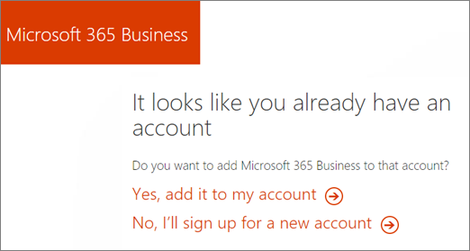
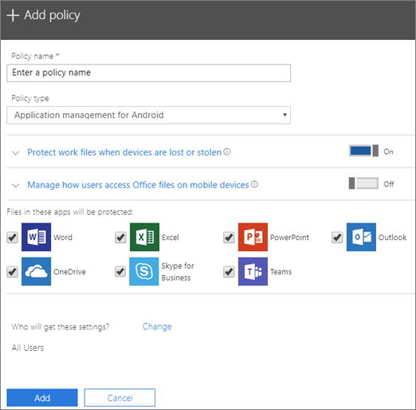

# Migrate to Microsoft 365 Business from Office 365 Business Premium

If you already have an Office 365 for business subscription, for example, Office 365 Business Premium, you can easily add licenses to Microsoft 365 Business, and assign them to some, or all users.
  
> [!NOTE]
> You can't use the [Switch plans](https://support.office.com/article/73318661-8f33-478b-bcc7-fb8d69dbb22a?.aspx#switchbutton) button to upgrade to Microsoft 365 Business yet. 
  
## Add Microsoft 365 Business licenses

You have two ways to get Microsoft 365 Business. A partner can purchase Microsoft 365 Business for you from [Microsoft Partner Center](get-microsoft-365-business.md). Your partner can also help you transition to Microsoft 365 Business.
  
If you manage your own subscription, you can [contact sales](https://www.microsoft.com/microsoft-365/business) to purchase Microsoft 365 Business licenses. 
  
See [Add, change, or delete a subscription advisor partner](https://support.office.com/article/f86e8177-936e-491e-9024-44dea2b296ff) to find out how you can start working with a partner. 
  
If you are given a link to purchase your licences, you will walk through a wizard like the one below. Choose **Yes, add it to my account**. You can also pick the number of licences and the method of payment.
  

  
## Assign Microsoft 365 licenses

1. Once you have purchased new licenses, and this is the first time you did, the setup banner for Microsoft 365 Business will display on top of the admin center.
    
    > [!NOTE]
    > The setup banner is an opportunity to add new users, a new domain, and migrate email for new users. If you don't plan to do any, you should still go through the wizard and choose default options to make it disappear from the admin home page. 
  
   
  
    Choose **Start setup**.
    
2. On the **Personalize your sign-in and email** page, you can add a domain by choosing **Connect a domain you already own** if you want to use this opportunity to add another domain to your subscription. 
    
    If you have already set up a domain, the second field will indicate that and will say **Continue using** \<  _your domain name_\> **for email and signing in**. If you haven't set up a domain with you subscription, it will say **Continue using** \<  _your company name.onmicrosoft.com_\> **for email and signing in**.
    
    Choose **Next**.
    
    
  
3. On the **Add new users** page, you can add new users, if you have new employees that you want to assign the Microsoft 365 Business licenses to. 
    
    If you don't have new employees to add and want to assign licences to existing users, choose **Next**.
    
4. On the ** Migrate email messages ** page you can choose to migrate email for any of the new users you added in step 3. You can skip this step also. Choose **Next**.
    
5. On the last page, choose **go to the admin center**, and continue setup there.
    
6. In the admin center, go to **Users** \> **Active users**.
    
7. Select the user to whom you want to assign the **Microsoft 365 Business** license to, and then choose **Edit** next to **Product Licenses**.
    
    
  
8. In **Product licenses** slide **Microsoft 365 Business** to **On** \> **Save**, and then **Close**.
    
Once you have purchased the initial license for Microsoft 365 Business, you can now also add more in **Billing** \> **Purchase services**. On the **Purchase services** page you can click on the ellipses on the **Microsoft 365 Business** card, and choose **Change license quantity** to purchase more. 
  
## Protect user devices and files

After you have assigned licenses to Microsoft 365 Business, you can start protecting the users' devices and files.
  
1. In the admin center, in the left nav, go to **Devices** \> **Policies**.
    
2. On the **Device policies** page, choose **Add**.
    
3. In the **Add policy** pane give the policy a name, and then choose a **Policy type** from the drop-down. 
    
    You can set up application policies for protecting files on Android and iPhone devices, as well as Windows 10, and you can set up device configuration policies for company owned Windows 10 devices. See the following links for details:
    
  - [Set app protection settings for Android or iOS devices](app-protection-settings-for-android-and-ios.md)
    
  - [Set application protection settings for Windows 10 devices](protection-settings-for-windows-10-devices.md)
    
  - [Set device protection settings for Windows 10 PCs](protection-settings-for-windows-10-pcs.md)
    
   
  
4. Once you set up policies, you and your employees can set up devices:
    
  - If your Windows aren't already on Windows Pro Creator update, you will need to [upgrade them to Windows Pro Creators Update](upgrade-to-windows-pro-creators-update.md).
    
  - See [Set up Windows devices for Microsoft 365 Business users](set-up-windows-devices.md) for steps for Windows devices. 
    
  - See [Set up mobile devices for Microsoft 365 Business users](set-up-mobile-devices.md) for steps for Android phones and iPhones. 
    
5. To automatically install Office client apps, see [Prepare for Office client deployment by Microsoft 365 Business](prepare-for-office-client-deployment.md) and [Automatically install or uninstall Office on Windows 10 devices](auto-install-or-uninstall-office.md).
    

