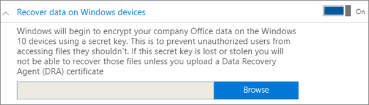
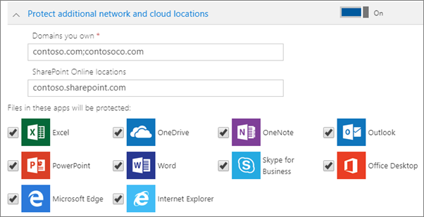

# Set or edit application protection settings for Windows 10 devices

This article applies to Microsoft 365 Business Premium.

## Edit an app management policy for Windows 10

1. Go to the admin center at <a href="https://go.microsoft.com/fwlink/p/?linkid=837890" target="_blank">https://admin.microsoft.com</a>.     
2. On the left nav, choose **Devices** \> **Policies** .
1. Choose an existing Windows app policy and then **Edit**.
1. Choose **Edit** next to a setting you want to change and then **Save**.

## Create an app management policy for Windows 10

If your users have personal Windows 10 devices on which they perform work tasks, you can protect your data on those devices as well.
  
1. Go to the admin center at <a href="https://go.microsoft.com/fwlink/p/?linkid=837890" target="_blank">https://admin.microsoft.com</a>. 
2. On the left nav, choose **Devices** \> **Policies** \> **Add**.
3. On the **Add policy** pane, enter a unique name for this policy. 
4. Under **Policy type**, choose **Application Management for Windows 10**.
5. Under **Device type**, choose either **Personal** or **Company Owned**.
6. The **Encrypt work files** is turned on automatically. 
7. Set **Prevent users from copying company data to personal files and force them to save work files to OneDrive for Business** to **On** if you don't want the users to save work files on their PC. 
9. Expand **Recover data on Windows devices**. We recommend that you turn it **On**.
    Before you can browse to the location of the Data Recovery Agent certificate, you have to first create one. For instructions, see [Create and verify an Encrypting File System (EFS) Data Recovery Agent (DRA) certificate](/windows/security/information-protection/windows-information-protection/create-and-verify-an-efs-dra-certificate).
    
    By default, work files are encrypted using a secret key that is stored on the device and associated with the user's profile. Only the user can open and decrypt the file. However, if a device is lost or a user is removed, a file can be stuck in an encrypted state. An admin can use the Data Recovery Agent (DRA) certificate to decrypt the file.
    
    
  
10. Expand **Protect additional network and cloud locations** if you want to add additional domains or SharePoint Online locations to make sure that files in all the listed apps are protected. If you need to enter more than one item for either field, use a semicolon (;) between the items.
    
    
  
11. Next decide **Who will get these settings?** If you don't want to use the default **All Users** security group, choose **Change**, choose the security groups who will get these settings \> **Select**.
12. Finally, choose **Add** to save the policy, and assign it to devices.