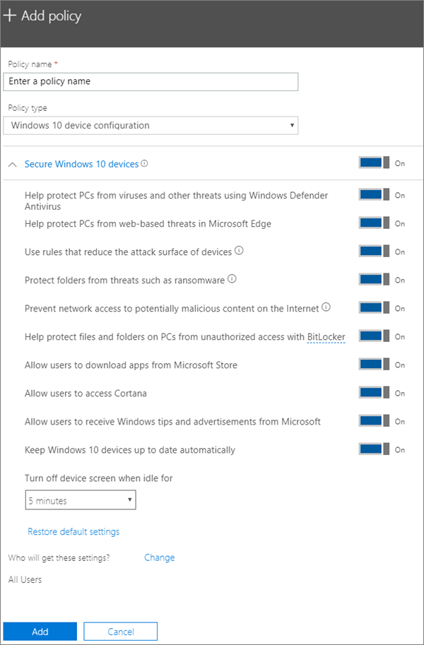

# Edit or create device protection settings for Windows 10 PCs

This article applies to Microsoft 365 Business Premium.

After you have set set up default Windows protection settings on the Setup page, you can add new ones that apply to either all users, or a set of users. You can also edit any of the ones you have created.

## Create protection settings for Windows 10 devices

View a video on how to secure Windows 10 devices with Microsoft 365 Business Premium:
  
> [!VIDEO https://www.microsoft.com/videoplayer/embed/a5734146-620a-4cec-8618-536b3ca37972?autoplay=false]
  
1. Go to the admin center at <a href="https://go.microsoft.com/fwlink/p/?linkid=837890" target="_blank">https://admin.microsoft.com</a>. 
2. On the left nav, choose **Devices** \> **Policies** \> **Add**.
3. On the **Add policy** pane, enter a unique name for this policy. 
4. Under **Policy type**, choose **Windows 10 Device Configuration**.
5. Expand **Secure Windows 10 Devices** \> configure the settings how you would like. For more information, see [Available settings](#available-settings). 
    
    You can always use the **Reset default settings** link to return to the default setting. 
    
    
  
6. Next decide **Who will get these settings?** If you don't want to use the default **All users** security group, Choose **Change**, search for the security group who will get these settings \> **Select**.
7. Finally, choose **Done** to save the policy, and assign it to devices. 

## Edit Windows 10 protection settings
 
1. Go to the admin center at <a href="https://go.microsoft.com/fwlink/p/?linkid=837890" target="_blank">https://admin.microsoft.com</a>.     
2. On the left nav, choose **Devices** \> **Policies** .
1. Choose an existing Windows device policy and then **Edit**.
1. Choose **Edit** next to a setting you want to change and then **Save**.

## Available settings

By default all settings are **On**. The following settings are available.
  
For more information, see [How do protection features in Microsoft 365 Premium map to Intune settings](map-protection-features-to-intune-settings.md). 
  
|||
|:-----|:-----|
|Setting    |Description    |
|Help protect PCs from viruses and other threats using Windows Defender Antivirus    |Requires that Windows Defender Antivirus is turned on to protect PCs from the dangers of being connected to the internet.    |
|Help protect PCs from web-based threats in Microsoft Edge    |Turns on settings in Edge that help protect users from malicious sites and downloads.    |
|Use rules that reduce the attack surface of devices    |When turned On, attack surface reduction helps block actions and apps typically used by malware to infect devices. This setting is only available if Windows Defender Antivirus is set to On. See [Reduce attack surfaces](/windows/security/threat-protection/microsoft-defender-atp/exploit-protection) to learn more.    |
|Protect folders from threats such as ransomware    |This setting uses controlled folder access to protect company data from modification by suspicious or malicious apps, such as ransomware. These types of apps are blocked from making changes in protected folders. This setting is only available if Windows Defender Antivirus is set to On. See [Protect folders with Controlled folder access](/mem/configmgr/protect/deploy-use/create-deploy-exploit-guard-policy#bkmk_CFA) to learn more.    |
|Prevent network access to potentially malicious content on the Internet    |Use this setting to block outbound user connections to low-reputation Internet locations that may host phishing scams, exploits, or other malicious content. This setting is only available if Windows Defender Antivirus is set to **On**. For more information, see [Protect your network](/windows/security/threat-protection/windows-defender-antivirus/configure-real-time-protection-windows-defender-antivirus).    |
|Help protect files and folders on PCs from unauthorized access with BitLocker    |Bitlocker protects data by encrypting the computer hard drives and protect against data exposure if a computer is lost or stolen. For more information, see [Bitlocker FAQ](/windows/security/information-protection/bitlocker/bitlocker-frequently-asked-questions).    |
|Allow users to download apps from Microsoft Store    |Lets users download and install apps from the Microsoft Store. Apps include everything from games to productivity tools, so we leave this setting **On**, but you can turn it off for extra security.    |
|Allow users to access Cortana    |Cortana can be very helpful! Cortana can turn settings on or off for you, give directions, and make sure you're on time for appointments, so we keep this setting **On** by default.    |
|Allow users to receive Windows tips and advertisements from Microsoft    |Windows tips can be handy and help orient users when new features are released.    |
|Keep Windows 10 devices up to date automatically    |Makes sure that Windows 10 devices automatically receive the latest updates.    |
|Turn off device screen when idle for this amount of time    |Makes sure that company data is protected if a user is idle. A user may be working in a public location, like a coffee shop, and step away or be distracted for just a moment, leaving their device vulnerable to random glances. This setting lets you control how long the user can be idle before the screen shuts off.    |