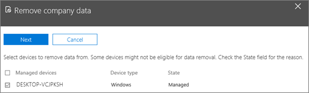

# Remove company data from devices

## Remove company data

You can use Microsoft 365 Business to remove company data that your users have on their [devices](app-protection-settings-for-android-and-ios.md) or [Windows PCs](protection-settings-for-windows-10-devices.md) that are protected by Microsoft 365. **If you remove company data from a device, you cannot restore it later**. 
  
1. Sign in to [Microsoft 365 Business](https://portal.office.com) with global admin credentials. 
    
2. On the left nav, choose**Devices** \> **Policies** \> **Manage**..
  
3. On the **Manage** page, choose or search for a user who's data you want to remove, and choose the name. 
    
4. On the next pane, select the device or devices from the **Managed devices** list to remove data from and choose **Next**. 
    
    
  
5. On the **Are you sure you want to remove company data on the devices** pane, choose **Remove** \> **Close**.
    

