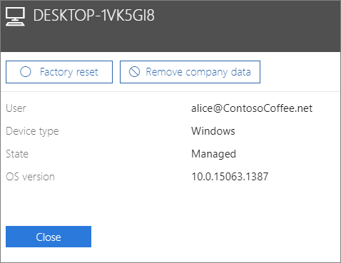

# Remove company data from devices

This article applies to Microsoft 365 Business Premium.

## Remove company data

You can use Microsoft 365 for business to remove company data that your users have on their [devices](app-protection-settings-for-android-and-ios.md) or [Windows PCs](protection-settings-for-windows-10-devices.md) that are protected by Microsoft 365. **If you remove company data from a device, you cannot restore it later**. 
  
1. Go to the admin center at <a href="https://go.microsoft.com/fwlink/p/?linkid=837890" target="_blank">https://admin.microsoft.com</a>.
    
2. On the left nav, choose **Devices**  \> **Manage**.
  
3. On the **Manage** page, choose or search for a user who's data you want to remove, and choose the name. 
    
4. On the next pane, select the device or devices from the **Devices** list. On the device pane that opens, you can choose to reset the device to factory settings or remove company data, depending on the device type. 
    
    
  
5. On the confirmation pane, choose **Confirm** \> **Close**.
    

