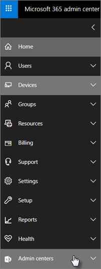

# Microsoft 365 Business Premium security and compliance features

Microsoft 365 Business Premium offers simplified security features to help safeguard your data on PCs, phones, and tablets.
    
## Microsoft 365 admin center security features

You can manage many of the Microsoft 365 Business Premium security features in the admin center, which gives you a simplified way to turn these features on or off. In the admin center, you can do the following:
  
- [Set application management settings for Android or iOS devices](app-protection-settings-for-android-and-ios.md) . 
    
    These settings include deleting files from an inactive device after a set period, encrypting work files, requiring that users set a PIN, and so on.
    
- [Set application protection settings for Windows 10 devices](protection-settings-for-windows-10-devices.md) . 
    
    These settings can be applied to company data on both company-owned, or personally owned devices.
    
- [Set device protection settings for Windows 10 devices](protection-settings-for-windows-10-pcs.md) . 
    
    You can enable [BitLocker](/windows/security/information-protection/bitlocker/bitlocker-frequently-asked-questions) encryption to help protect data in case a device is lost or stolen, and enable [Windows Exploit Guard](/windows/security/threat-protection/microsoft-defender-atp/enable-exploit-protection) to provide advanced protection against ransomware. 
    
- [Remove company data from devices](remove-company-data.md)
    
    You can remotely wipe company data if a device is lost, stolen, or an employee leaves your company.
    
- [Reset Windows 10 devices to their factory settings](reset-devices-to-factory-settings.md) . 
    
    You can reset any Windows 10 devices that have device protection settings applied to them.
    
## Additional security features 

Advanced features in Microsoft 365 Business Premium are available to help you protect your business against cyber-threats and safeguard sensitive information.
  
- **[Microsoft Defender for Office 365](../security/office-365-security/defender-for-office-365.md)**
    
    Microsoft Defender for Office 365 helps guard your business against sophisticated phishing and ransomware attacks designed to compromise employee or customer information. Features include:
    
  - Sophisticated attachment scanning and AI-powered analysis to detect and discard dangerous messages.
    
  - Automatic checks of links in email to assess if they're part of a phishing scheme. This keeps you safe from accessing unsafe websites.

- **[The full capabilities of Intune in the Azure portal](/mem/intune/fundamentals/what-is-intune)**
    
    Accessing the Intune admin center in the Azure portal allows you to set up additional security features, such as management of MacOS devices, iPhone, and Android devices, along with advanced device management for Windows, that aren't available through Microsoft 365 admin center.
- **Same [Conditional Access](/azure/active-directory/conditional-access/overview) as Azure AD Premium P1 plan**

    Conditional Access can help protect your organization from sign-in risk, access attempts from an unexpected network or locale, access attempts from risky device types, and so on. Conditional Access policies are enforced after the first authentication is completed, and it uses signals from the first authentication event to determine if the attempted access should be approved, denied, or if more proof (such as a second form of identification) is required.

    The conditional access features included are:

    - Access based on username, group, and role
    - Access [based on an app](/azure/active-directory/conditional-access/app-based-conditional-access) 
    - [Access based on location](/azure/active-directory/authentication/howto-registration-mfa-sspr-combined#conditional-access-policies-for-combined-registration);  only allow access from trusted IP ranges or specific countries 
    - Require MFA for access
    - Block access to apps that use [legacy authentication](/azure/active-directory/conditional-access/block-legacy-authentication)
    - Require apps to use [Intune app protection](/azure/active-directory/conditional-access/app-protection-based-conditional-access)
    - Custom authentication such as MFA with third-party providers, for example DUO.
   
    Other features:
    - [Self-service password reset](/azure/active-directory/authentication/concept-sspr-customization) for hybrid Azure AD
    
## Compliance features

Your Microsoft 365 Business Premium subscription includes features that help you maintain compliance and regulatory standards.

- **[Learn about data loss prevention](../compliance/dlp-learn-about-dlp.md))** (DLP). 
    
    You can set up DLP to automatically detect sensitive information, like credit card numbers, social security numbers, and so on, to prevent their inadvertent sharing outside your company.
    
- **[Exchange Online Archiving](https://products.office.com/exchange/microsoft-exchange-online-archiving-email)**
    
    Exchange Online Archiving license enables messages to be easily archived with continuous data backup. It stores all of a user's emails, including deleted items, in case they're needed later for discovery or restoration. Additionally, you can use different retention policies to preserve email data for litigation holds, eDiscovery, or to meet compliance requirements.
    
- **[Sensitivity labels](../compliance/sensitivity-labels.md)**

   Microsoft 365 Business Premium includes all the features of [Azure Information Protection Plan 1](https://go.microsoft.com/fwlink/p/?linkid=871407). With this plan, you can create **Sensitivity labels** that allow you to control access to sensitive information in email and documents, with controls like "Do not forward" and "Do not copy." You can also classify sensitive information as "Confidential" and specify how classified information can be shared outside and inside the business. Enterprise-grade encryption is easy to apply to email and documents to keep your information private. You can also install the Azure Information Protection client add-in for Office apps. For more information, see [Azure Information Protection unified labeling client](/azure/information-protection/rms-client/unifiedlabelingclient-version-release-history). For Sensitivity labels, install the **AzInfoProtection_UL.exe**.

You can manage these features in the Security &amp; Compliance center and the Intune admin center. Over time the simplified controls will be added to the Microsoft 365 admin center.
  
    
## FAQ

 ### Are these security features available in all markets?
  
Yes, these features are available in all markets where Microsoft 365 Business Premium is sold.
  
### How do I find the Security &amp; Compliance center?
  
1. [Sign in to Microsoft 365 Business Premium](https://portal.microsoft.com/) by using your admin credentials. 
    
2. In the left nav, locate **Admin centers** and expand it. 
    
    
  
3. Choose **Security &amp; Compliance** to go to Security &amp; compliance center.
