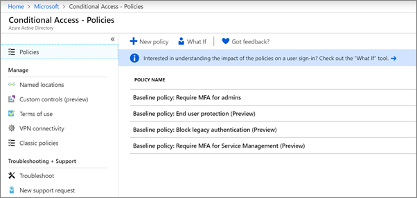

# Set up conditional access policies

[Conditional access](https://docs.microsoft.com/azure/active-directory/conditional-access/overview) policies add substantial additional security. Microsoft provides a set of baseline conditional access policies that are recommended for all customers. Baseline policies are a set of predefined policies that help protect organizations against many common attacks. These common attacks can include password spray, replay, and phishing.

These policies require admins and users to enter a second form of authentication (called multifactor authentication, or MFA) when certain conditions are met. For example, if a user is signing in from a different country, the sign-in might be considered risky and the user must provide an additional form of authentication. 

Currently, baseline policies include the following:
- **Require MFA for admins** &ndash; Requires multi-factor authentication for the most privileged administrator roles, including global administrator.
- **End user protection** &ndash; Requires multi-factor authentication for users only when a sign-in is risky. 
- **Block legacy authentication** &ndash; Older client apps and some new apps don't use newer, more secure, authentication protocols. These older apps can bypass conditional access policies and gain unauthorized access to your environment. This policy blocks access from clients that don't support conditional access. 
- **Require MFA for Service Management** &ndash; Requires multi-factor authentication for access to management tools, including Azure portal (where you configure baseline policies). 

Microsoft recommends you enable all of these baseline policies. After these policies are enabled, admins and users will be prompted to register for Azure Multii-Factor authentication.

For more information about these policies, see [What are baseline policies](https://docs.microsoft.com/azure/active-directory/conditional-access/concept-baseline-protection)?

## Set up baseline policies

1. Go to [Azure portal](https://portal.azure.com), and then navigate to **Azure Active Directory** \> **Conditional Access**.
    
    The baseline policies are listed on the page.    
    
1. See the following specific instructions for each policy:

  - [Require MFA for admins](https://docs.microsoft.com/azure/active-directory/conditional-access/howto-baseline-protect-administrators)
- [Require MFA for users](https://docs.microsoft.com/azure/active-directory/conditional-access/howto-baseline-protect-end-users)  
 - [Block legacy authentication](https://docs.microsoft.com/azure/active-directory/conditional-access/howto-baseline-protect-legacy-auth)
  - [Require MFA for service management](https://docs.microsoft.com/azure/active-directory/conditional-access/howto-baseline-protect-azure)

You can set up many additional policies, such as requiring approved client apps. For more information, see the [Conditional Access Documentation](https://docs.microsoft.com/azure/active-directory/conditional-access/).
