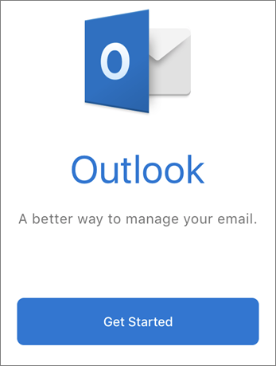
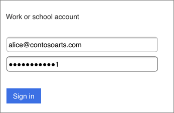
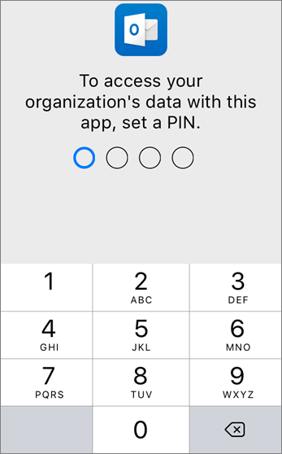
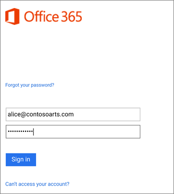

# Set up mobile devices for Microsoft 365 for business users

Follow the instructions in the tabs to install Office on an iPhone or an Android phone. After you follow these steps, your work files created in Office apps will be protected by Microsoft 365 for business.

The example is for Outlook, but applies for any other Office apps you want to install also.
  
## Set up mobile devices

## [iPhone](#tab/iPhone)
  
Watch a short video on how to set up Office apps on iOS devices with Microsoft 365 for business.  

> [!VIDEO https://www.microsoft.com/videoplayer/embed/RWee2n] 

If you found this video helpful, check out the [complete training series for small businesses and those new to Microsoft 365](../business-video/index.yml).

Go to **App store**, and in the search field type in Microsoft Outlook.
  

  
Tap the cloud icon to install Outlook.
  

  
When the installation is done, tap the **Open** button to open Outlook and then tap **Get Started**.
  

  
Enter your work email address on the **Add Email Account** screen \> **Add Account**, and then enter your Microsoft 365 for business credentials \> **Sign in**.
  

  
If your organization is protecting files in apps, you'll see a dialog stating that your organization is now protecting the data in the app and you need to restart the app to continue to use it. Tap **OK** and close Outlook. 
  

  
Locate Outlook on the iPhone, and restart it. When prompted, enter a PIN and verify it. Outlook on your iPhone is now ready to be used.
  

  
## [Android](#tab/Android)
  
Watch a video about installing Outlook and Office on Android devices.  

> [!VIDEO https://www.microsoft.com/videoplayer/embed/ecc2e9c0-bc7e-4f26-8b14-91d84dbcfef0] 

If you found this video helpful, check out the [complete training series for small businesses and those new to Microsoft 365](../business-video/index.yml).

To begin setup on your Android phone, go to the Play Store.
  

  
Enter Microsoft Outlook in the Google Play search box and tap **Install**. Once Outlook is done installing, tap **Open**.
  

  
In the Outlook app, tap **Get Started**, then add your Microsoft 365 for business email account \> **Continue**, and sign in with your organization credentials.
  

  
In the dialog that states you must install the Intune Company Portal app, tap **Go to store**.
  

  
In Play Store, install Intune Company Portal.
  

  
Open Outlook again, and enter and confirm a PIN. Your Outlook app is now ready for use.
  

## See also

[Microsoft 365 for business training videos](../business-video/index.yml)

---
