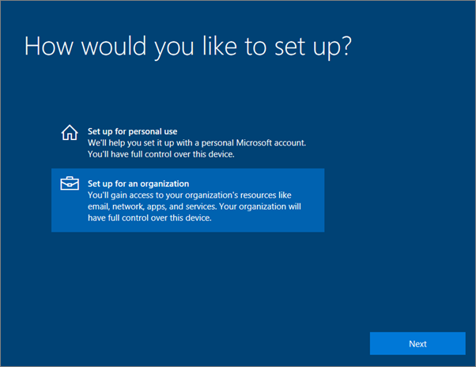
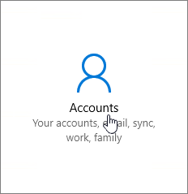
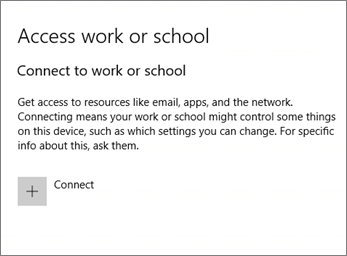
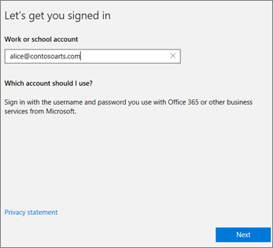
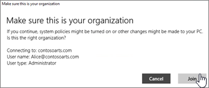
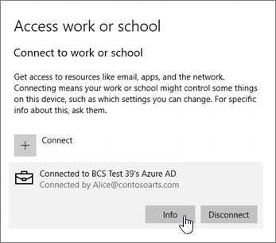
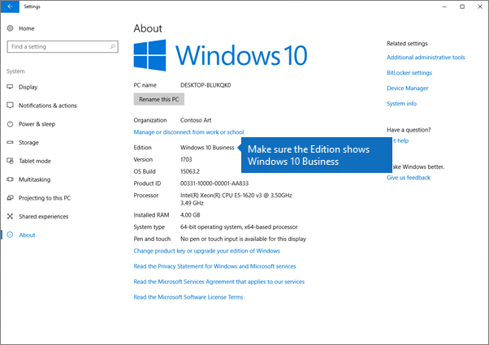

# Set up Windows devices for Microsoft 365 Business Premium users

## Before you begin

Before you can set up Windows devices for Microsoft 365 Business Premium users, make sure all the Windows devices are running Windows 10 Pro, version 1703 (Creators Update). Windows 10 Pro is a prerequisite for deploying Windows 10 Business, which is a set of cloud services and device management capabilities that complement Windows 10 Pro and enable the centralized management and security controls of Microsoft 365 Business Premium.
  
If you have Windows devices running Windows 7 Pro, Windows 8 Pro, or Windows 8.1 Pro, your Microsoft 365 Business Premium subscription entitles you to a Windows 10 upgrade.
  
For more information on how to upgrade Windows devices to Windows 10 Pro Creators Update, follow the steps in this topic: [Upgrade Windows devices to Windows Pro Creators Update](upgrade-to-windows-pro-creators-update.md).
  
See [Verify the device is connected to Azure AD](#verify-the-device-is-connected-to-azure-ad) to verify you have the upgrade, or to make sure the upgrade worked.

## Watch: Connect your PC to Microsoft 365 Business

> [!VIDEO https://www.microsoft.com/videoplayer/embed/RE3yXh3] 

If you found this video helpful, check out the [complete training series for small businesses and those new to Microsoft 365](../business-video/index.yml).
  
## Join Windows 10 devices to your organization's Azure AD

When all Windows devices in your organization have either been upgraded to Windows 10 Pro Creators Update or are already running Windows 10 Pro Creators Update, you can join these devices to your organization's Azure Active Directory. Once the devices are joined, they'll be automatically upgraded to Windows 10 Business, which is part of your Microsoft 365 Business Premium subscription.
  
### For a brand new, or newly upgraded, Windows 10 Pro device

For a brand new device running Windows 10 Pro Creators Update, or for a device that was upgraded to Windows 10 Pro Creators Update but has not gone through Windows 10 device setup, follow these steps.
  
1. Go through Windows 10 device setup until you get to the **How would you like to set up?** page. 
    
    
  
2. Here, choose **Set up for an organization** and then enter your username and password for Microsoft 365 Business Premium. 
    
3. Finish Windows 10 device setup.
    
   Once you're done, the user will be connected to your organization's Azure AD. See [Verify the device is connected to Azure AD](#verify-the-device-is-connected-to-azure-ad) to make sure. 
  
### For a device already set up and running Windows 10 Pro

 **Connect users to Azure AD:**
  
1. In your user's Windows PC, that is running Windows 10 Pro, version 1703 (Creators Update) (see [pre-requisites](pre-requisites-for-data-protection.md)), click the Windows logo, and then the Settings icon.
  
   
  
2. In **Settings**, go to **Accounts**.
  
   
  
3. On **Your info** page, click **Access work or school** \> **Connect**.
  
   
  
4. On the **Set up a work or school account** dialog, under **Alternate actions**, choose **Join this device to Azure Active Directory**.
  
   
  
5. On the **Let's get you signed in** page, enter your work or school account \> **Next**.
  
   On the **Enter password** page, enter your password \> **Sign in**.
  
   
  
6. On the **Make sure this is your organization** page, verify that the information is correct, and choose **Join**.
  
   On the **You're all set!** page, chosse **Done**.
  
   
  
If you uploaded files to OneDrive for Business, sync them back down. If you used a third-party tool to migrate profile and files, also sync those to the new profile.
  
## Verify the device is connected to Azure AD

To verify your sync status, on the **Access work or school** page in **Settings**, select the **Connected to** _ \<organization name\> _ area to expose the buttons **Info** and **Disconnect**. Choose **Info** to get your synchronization status. 
  
On the **Sync status** page, choose **Sync** to get the latest mobile device management policies onto the PC.
  
To start using the Microsoft 365 Business Premium account, go to the Windows **Start** button, right-click your current account picture, and then **Switch account**. Sign in by using your organization email and password.
  

  
## Verify the PC is upgraded to Windows 10 Business

Verify that your Azure AD joined Windows 10 devices are upgraded to Windows 10 Business as part of your Microsoft 365 Business Premium subscription.
  
1. Go to **Settings** \> **System** \> **About**.
    
2. Confirm that the **Edition** shows **Windows 10 Business**.
    
    
  
## Next steps

To set up your mobile devices, see [Set up mobile devices for Microsoft 365 Business Premium users](set-up-mobile-devices.md), To set device protection or app protection policies, see [Manage Microsoft 365 for business](manage.md).
  
## Related content

[Microsoft 365 for business training videos](../business-video/index.yml) (link page)
