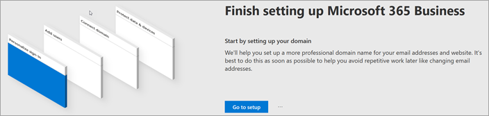
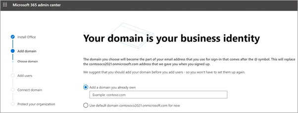
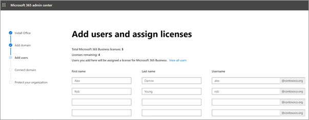
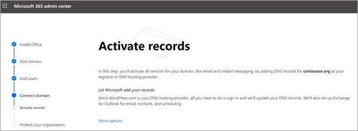
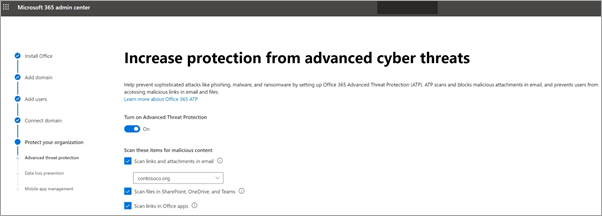
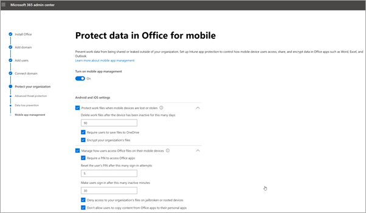

# Set up Microsoft 365 Business Premium in the setup wizard

Watch this video for an overview of Microsoft 365 Business Premium setup.  

> [!VIDEO https://www.microsoft.com/videoplayer/embed/RE4jZwg] 

## Add your domain, users, and set up policies

When you purchase Microsoft 365 Business Premium, you have the option of using a domain you own, or buying one during the [sign-up](sign-up.md).

- If you purchased a new domain when you signed up, your domain is all set up and you can move to [Add users and assign licenses](#add-users-and-assign-licenses).

### Add your domain to personalize sign-in

1. Sign in to [Microsoft 365 admin center](https://admin.microsoft.com) by using your global admin credentials. 

2. Choose **Go to setup** to start the wizard.

    

3. On the **Install your Office apps** page, you can optionally install the apps on your own computer.
    
4. In the **Add domain** step, enter the domain name you want to use (like contoso.com).

    > [!IMPORTANT]
    > If you purchased a domain during the sign-up, you will not see **Add a domain** step here. Go to [Add users](#add-users-and-assign-licenses) instead.

    

    
4. Follow the steps in the wizard to [Create DNS records at any DNS hosting provider for Microsoft 365](/office365/admin/get-help-with-domains/create-dns-records-at-any-dns-hosting-provider) that verifies you own the domain. If you know your domain host, see also the [host specific instructions](/office365/admin/get-help-with-domains/set-up-your-domain-host-specific-instructions).

    If your hosting provider is GoDaddy or another host enabled with [domain connect](/office365/admin/get-help-with-domains/domain-connect), the process is easy and you'll be automatically asked to sign in and let Microsoft authenticate on your behalf.

    

### Add users and assign licenses

You can add users in the wizard, but you can also [add users later](../admin/add-users/add-users.md) in the admin center. Additionally, if you have a local domain controller, you can add users with [Azure AD Connect](/azure/active-directory/hybrid/how-to-connect-install-express).

#### Add users in the wizard

Any users you add in the wizard get automatically assigned a Microsoft 365 Business Premium license.

1. If your Microsoft 365 Business Premium subscription has existing users (for example, if you used Azure AD Connect), you get an option to assign licenses to them now. Go ahead and add licenses to them as well.

2. After you've added the users, you'll also get an option to share credentials with the new users you added. You can choose to print them out, email them, or download them.

### Connect your domain

> [!NOTE]
> If you chose to use the .onmicrosoft domain, or used Azure AD Connect to set up users, you will not see this step.
  
To set up services, you have to update some records at your DNS host or domain registrar.
  
1. The setup wizard typically detects your registrar and gives you a link to step-by-step instructions for updating your NS records at the registrar website. If it doesn't, [Change nameservers to set up Microsoft 365 with any domain registrar](../admin/get-help-with-domains/change-nameservers-at-any-domain-registrar.md). 

    - If you have existing DNS records, for example an existing web site, but your DNS host is enabled for [domain connect](/office365/admin/get-help-with-domains/domain-connect), choose **Add records for me**. On the **Choose your online services** page, accept all the defaults, and choose **Next**, and choose **Authorize** on your DNS host's page.
    - If you have existing DNS records with other DNS hosts (not enabled for domain connect), you'll want to manage your own DNS records to make sure the existing services stay connected. See [domain basics](/office365/admin/get-help-with-domains/dns-basics) for more info.

        

2. Follow the steps in the wizard and email and other services will be set up for you.

### Protect your organization 

The policies you set up in the wizard are applied automatically to a [Security group](/office365/admin/create-groups/compare-groups#security-groups) called *All Users*. You can also create additional groups to assign policies to in the admin center.

1. On the **Increase protection from advanced cyber threats**, it is recommended that you accept the defaults to let [Office 365 Advance Threat Protection](../security/office-365-security/defender-for-office-365.md) scan files and links in Office apps.

    

2. On the **Prevent leaks of sensitive data** page, accept the defaults to turn on Office 365 Data Loss Prevention (DLP) to track sensitive data in Office apps and prevent the accidental sharing of these outside your organization.

3. On the **Protect data in Office for mobile** page, leave mobile app management on, expand the settings and review them, and then select **Create mobile app management policy**.

    

## Secure Windows 10 PCs

On the left nav, select **Setup** and then, under **Sign-in and security**, choose **Secure your Windows 10 computers**. Choose **View** to get started. See [secure your Windows 10 computers](secure-win-10-pcs.md) for complete instructions.

## Deploy Office 365 client apps

If you chose to automatically install Office apps during setup, the apps will install on the Windows 10 devices once the users have signed in to Azure AD from their Windows devices, using their work credentials.

To install Office on mobile iOS or Android devices, see [Set up mobile devices for Microsoft 365 Business Premium users](set-up-mobile-devices.md).

You can also install Office individually. See [install Office on a PC or Mac](https://support.microsoft.com/office/4414eaaf-0478-48be-9c42-23adc4716658) for instructions.

## See also

[Microsoft 365 for business training videos](../business-video/index.yml)
