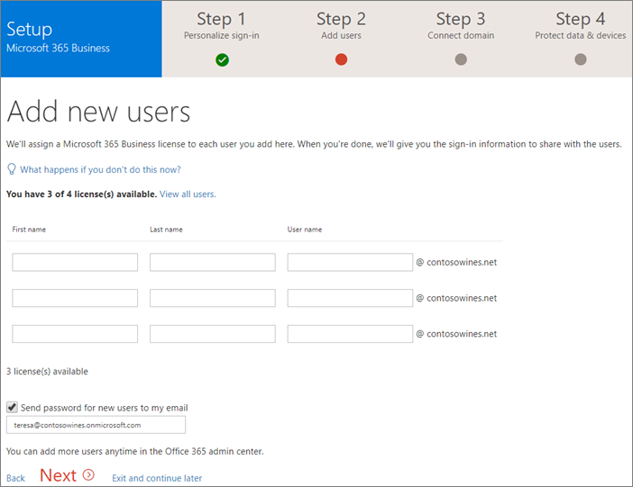
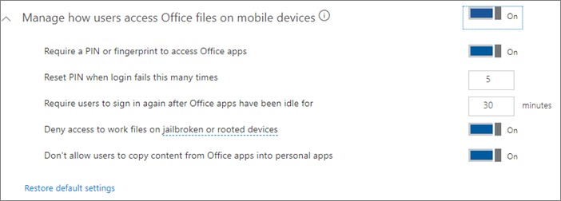
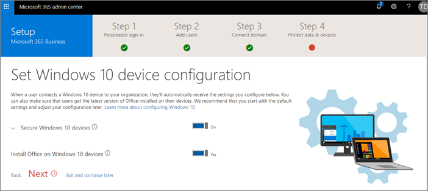

# Set up Microsoft 365 Business in the setup wizard

## Add your domain, users, and set up policies

When you purchase Microsoft 365 Business, you have the option of using a domain you own, or buying one during the [sign-up](sign-up.md).

- If you purchased a new domain when you signed up, your domain is all set up and you can move to [Add users and assign licenses](#add-users-and-assign-licenses).

### Add your domain to personalize sign-in

1. Sign in to [Microsoft 365 admin center](https://admin.microsoft.com) by using your global admin credentials. 

2. Choose **Add a domain** or **Add users** to start the wizard.
    > [!IMPORTANT]
    > If you purchased a domain during the sign-up, you will not see **Add a domain** step here. Go to [Add users ](#add-users-and-assign-licenses) instead.

    
    
3. In the wizard, enter the domain name you want to use (like contoso.com).

    

    
4. Follow the steps in the wizard to [Create DNS records at any DNS hosting provider for Office 365](https://docs.microsoft.com/office365/admin/get-help-with-domains/create-dns-records-at-any-dns-hosting-provider) that verifies you own the domain. If you know your domain host, see also the [host specific instructions](https://docs.microsoft.com/office365/admin/get-help-with-domains/set-up-your-domain-host-specific-instructions).

    If your hosting provider is GoDaddy, or another host enabled with [domain connect](https://docs.microsoft.com/office365/admin/get-help-with-domains/domain-connect),the process is easy and you will be automatically asked to sign in and let Microsoft authenticate on your behalf:

    

### Add users and assign licenses

You can add users in the wizard, but you can also [add users later](add-users-m365b.md) in the admin center. Additionally, if you have a local domain controller, you can add users with [Azure AD Connect](https://docs.microsoft.com/azure/active-directory/hybrid/how-to-connect-install-express).

#### Add users in the wizard

Any users you add in the wizard get automatically assigned a Microsoft 365 Business license.

1. If your Microsoft 365 Business subscription has existing users (for example, if you used Azure AD Connect) , you get an option to assign licenses to them now. Go ahead and add licenses to them as well.

3. After you have added the users, you will also get an option to share credentials with the new users you added. You can choose to print them out, email them, or download them.

4. Skip migrating email messages and choose **Next** on **Migrate email messages** page. 

    If you are moving from another email provider and want to copy your data later, you can [Migrate email and contacts to Office 365](https://support.office.com/article/a3e3bddb-582e-4133-8670-e61b9f58627e).

### Connect your domain

> [!NOTE]
> If you chose to use the .onmicrosoft domain, or used Azure AD Connect to set up users, you will not see this step.
  
To set up services, you have to update some records at your DNS host or domain registrar.
  
1. The setup wizard typically detects your registrar and gives you a link to step-by-step instructions for updating your NS records at the registrar website. If it doesn't, [Change nameservers to set up Office 365 with any domain registrar](https://support.office.com/article/a8b487a9-2a45-4581-9dc4-5d28a47010a2). 

    - If you have existing DNS records, for example an existing web site, but your DNS host is enabled for [domain connect](https://docs.microsoft.com/office365/admin/get-help-with-domains/domain-connect), choose **Add records for me**. 
    - If you have existing DNS records with other DNS hosts (not enabled for domain connect), you will want to manage your own DNS records to make sure the existing services stay connected. See [domain basics](https://docs.microsoft.com/office365/admin/get-help-with-domains/dns-basics) for more info.

        

2. Follow the steps in the wizard and email and other services will be set up for you.

### Set up security policies and device configurations 

The policies you set up in the wizard are applied automatically to a [Security group](https://docs.microsoft.com/office365/admin/create-groups/compare-groups#security-groups) called *All Users*. You can also create additional groups to assign policies to in the admin center.

1. On the **Protect your work files on mobile devices** the option **Protect work files when devices are lost or stolen** is selected by default. You have an option to turn on **Manage how users access Office files on mobile devices**, and this is recommended.

    

     - Expand **Protect work files when devices are lost or stolen** to display the [default values](protect-work-files-on-lost-or-stolen-device.md):

        

    - Select **Manage how users access Office files on mobile devices** and expand it to display the [default values](manage-user-access-on-mobile-devices.md). We recommend that you accept the default values during setup to create application policies for Android, iOS, and Windows 10 that apply to all users. You can create more policies after setup completes.

        

2. The last step on protect data and devices allows you to set up policies to secure Windows 10 devices. These settings are applied automatically when a user's Windows 10 connects to your organization. You can expand **Secure Windows 10 devices** to see and modify the [default values](secure-windows-10-devices.md).
3. You can also choose to [automatically install Office](install-office-on-windows-10-during-setup.md) on Windows 10 devices.

    

## Deploy Office 365 client apps

If you chose to automatically install Office apps in during the set up, the apps will install on the Windows 10 devices once the users have signed in to Azure AD from their Windows devices with their work credentials.
To install Office on mobile iOS or Android devices, see [Set up mobile devices for Microsoft 365 Business users](set-up-mobile-devices.md).

You can also install Office individually. See [install Office on a PC or Mac](https://support.office.com/article/4414eaaf-0478-48be-9c42-23adc4716658) for instructions.
