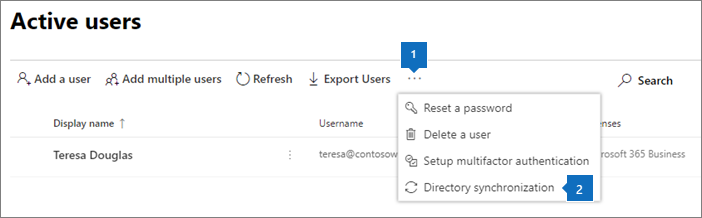

# Set up Microsoft 365 Business
Watch a video on how to set up Microsoft 365 Business when you don't have an on-premises Active Directory:
  
> [!VIDEO https://www.microsoft.com/videoplayer/embed/0705c337-f3e8-4d28-bb6c-530cd28e99f2?autoplay=false]

## Add your domain, users and set up policies

When you purchase Microsoft 365 Business, you have the option of using a domain you own, or buying one during the [sign-up](sign-up.md).

- If you purchased a new domain when you signed up, your domain is all set up and you can move to [Step 2: Add users and assign licenses](#step-2-add-users-and-assign-licenses)

### Add your domain to personalize sign-in

1. Sign in to [Microsoft 365 admin center](https://admin.microsoft.com) by using your global admin credentials. 

2. Choose **Add a domain** to start the wizard.

    
    
3. In the wizard, enter the domain name you want to use (like contoso.com).

    

    
4. Follow the steps in the wizard to [Create DNS records at any DNS hosting provider for Office 365](https://docs.microsoft.com/office365/admin/get-help-with-domains/create-dns-records-at-any-dns-hosting-provider) that verifies you own the domain. If you know your domain host, see also the [host specific instructions](https://docs.microsoft.com/office365/admin/get-help-with-domains/set-up-your-domain-host-specific-instructions).

    If your hosting provider is GoDaddy, the process is easy and you will be automatically asked to sign in and let Microsoft authenticate on your behalf:

    

### Add users and assign licenses

You can add users in the wizard, but you can also [add users later](add-users-m365b.md) in the admin center. Additionally, if you have a local domain controller, you can add users with [Azure AD Connect](https://docs.microsoft.com/azure/active-directory/hybrid/how-to-connect-install-express).

#### Add users in the wizard

Any users you add in the wizard get automatically assigned a Microsoft 365 Business license.
If you have a local domain controller, and are using Active Directory, see [how to ddd users by using Azure AD Connect](#add-users-by-using-azure-ad-connect).

1. If your Microsoft 365 Business subscription has existing users (for example, if you used Azure AD Connect) , you will get an option to assign licenses to them now. Go ahead and add licenses to them as well.

3. After you have added the users, you will also get an option to share credentials with the new users you added. You can choose to print them out, email them, or download them.

4. Skip migrating email messages and choose **Next** on **Migrate email messages** page. 

    If you are moving from another email provider and want to copy your data later, you can [Migrate email and contacts to Office 365](https://support.office.com/article/a3e3bddb-582e-4133-8670-e61b9f58627e).

#### Add users by using Azure AD Connect

 If you have a local domain controller with Active Directory, you synchronize your users with Microsoft 365 Business by using [Azure AD Connect](https://docs.microsoft.com/azure/active-directory/hybrid/how-to-connect-install-express). Complete this before you start the setup wizard. You can download it in the admin center:

- Go to **Users** \> **Active users**, select the ellipses on the top of the page and then select **Directory synchronization** to download Azure AD Connect.

    

    > [!IMPORTANT]
    > If you create users this way, you will still have to assign licenses to them in the admin center.

##### Continue to access domain-joined apps and devices

If you want to continue to access domain-joined apps and devices, read the following articles for two different way of enabling that:
  
- [Enable domain-joined Windows 10 devices to be managed by Microsoft 365 Business](manage-windows-devices.md)
    - This is the recommended way.

- [Access on-premises resources from an Azure AD-joined device in Microsoft 365 Business](access-resources.md)

### Connect your domain

> [!NOTE]
> If you chose to use the .onmicrosoft domain, or used Azure AD Connect to set up users, you will not see this step.
  
To set up services, you have to update some records at your DNS host or domain registrar.
  
1. The setup wizard typically detects your registrar and gives you a link to step-by-step instructions for updating your NS records at the registrar website. If it doesn't, [Change nameservers to set up Office 365 with any domain registrar](https://support.office.com/article/a8b487a9-2a45-4581-9dc4-5d28a47010a2). 

    - If you have existing DNS records, for example an existing web site, you will want to manage your own DNS records to make sure the existing services stay connected. See [domain basics](https://docs.microsoft.com/office365/admin/get-help-with-domains/dns-basics) for more info.

        

2. Follow the steps in the wizard and email and other services will be set up for you.

### Set up security policies and device configurations 

These policies apply to every user you give a license to, or to a group of users if you decide to assign different policies to a set of users.

#### Set up policies in the wizard

The policies you set up in the wizard are applied automatically to a [Security group](https://docs.microsoft.com/office365/admin/create-groups/compare-groups#security-groups) called *All Users*.

1. On the **Protect your work files on mobile devices** the option **Protect work files when devices are lost or stolen** is selected by default. You have an option to turn on **Manage how users access Office files on mobile devices**, and this is recommended.

    

     - If you expand **Protect work files when devices are lost or stolen**, the [default values](protect-work-files-on-lost-or-stolen-device.md) are pre-selected:

        

    - If you select **Manage how users access Office files on mobile devices** and expand it, the [default values](manage-user-access-on-mobile-devices.md) are shown. We recommend you accept the default values during setup to create application policies for Android, iOS, and Windows 10 that apply to all users. You can create more policies after setup completes.

        

2. The last step on protect data and devices allows you to set up policies to secure Windows 10 devices. These settings are applied automatically when a user's Windows 10 connects to your organization.

#### Modify or add policies in the admin center

## Deploy Office 365 client apps

## Deploy and manage Windows 10

## Additional security settings

In addition to the security and compliance setting in the setup wizard, you can also set up the following additional settings:
  
- Set up protection against unsafe attachments. **Advanced Threat Protection** (ATP) identifies malicious content and then blocks delivery of unsafe attachments, helping protect you against phishing schemes and ransomware infections. To activate attachment protection, see [Set up Office 365 ATP Safe Attachments policies](https://support.office.com/article/078eb946-819a-4e13-8673-fe0c0ad3a775#setpolicy).
    
- Protect your environment when users click malicious links. ATP examines links in email at the time a user clicks them. If a link is unsafe, the user is warned not to visit the site or informed that the site has been blocked. This helps protect against phishing schemes. [Set up Office 365 ATP Safe Links policies](https://support.office.com/article/bdd5372d-775e-4442-9c1b-609627b94b5d#reveddefaultscc) or [Set up Office 365 ATP Safe Links policies](https://support.office.com/article/bdd5372d-775e-4442-9c1b-609627b94b5d#addemailpolscc).
    
- You can preserve all mailbox content including deleted items by putting a user's entire mailbox on **litigation hold**. For instructions, see 
- [Set up email retention with Exchange Online Archiving](security-features.md#set-up-email-retention-with-exchange-online-archiving).
    
- Set up customized **retention policies**, for example, to preserve for a specific amount of time or delete content permanently at the end of the retention period. You can enable customized retention policies in the Securities and compliance center, go to **Data governance** \> **Retention**, and then follow the steps in the wizard. To learn more, see [Overview of retention policies](https://support.office.com/article/5e377752-700d-4870-9b6d-12bfc12d2423).
    
## Next steps

For the users that have their licenses, the next step is to set up devices.  See [Set up Windows devices for Microsoft 365 Business users](set-up-windows-devices.md) and [Set up mobile devices for Microsoft 365 Business users](set-up-mobile-devices.md).  See [Manage Microsoft 365 Business](manage.md) for links to topics on how to set device and app protection polices, and how to remove data from user devices. 
  

