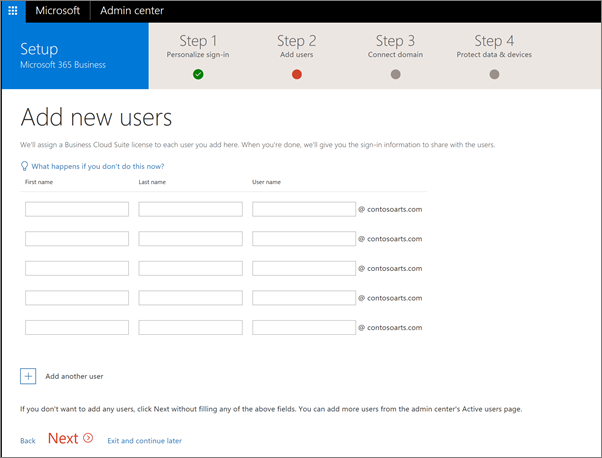
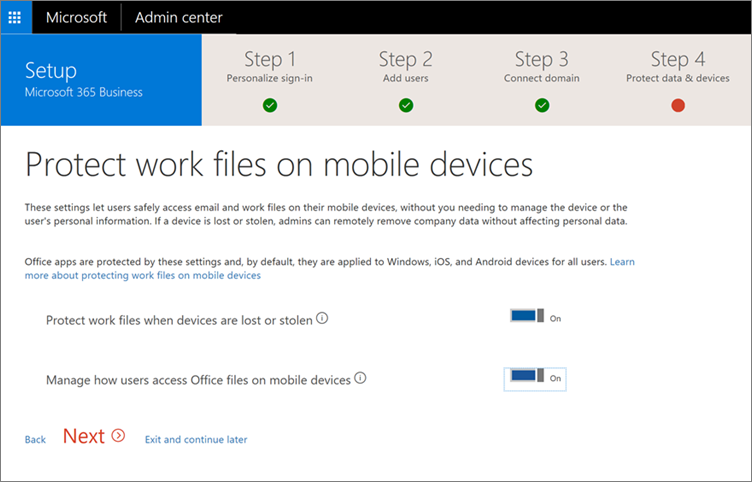

# Set up Microsoft 365 Business
Watch a video on how to set up Microsoft 365 Business when you don't have an on-premises Active Directory:
  
> [!VIDEO https://www.microsoft.com/videoplayer/embed/0705c337-f3e8-4d28-bb6c-530cd28e99f2?autoplay=false]

## Add your domain, users and set up policies

When you purchase Microsoft 365 Business, you have the option of using a domain you own, or buying one during the sign-up.
    1. If you purchased a new domain when you signed up, your domain is all set up and you can move to [Step 2: Add users and assign licenses](#step-2-add-users-and-assign-licenses)

### Add your domain to personalize sign-in

1. Sign in to [Microsoft 365 admin center](https://admin.microsoft.com) by using your global admin credentials. 

2. Choose **Add a domain** to start the wizard.

    
    
3. In the wizard, enter the domain name you want to use (like contoso.com).

    

    
4. Follow the steps in the wizard to [Create DNS records at any DNS hosting provider for Office 365](https://docs.microsoft.com/office365/admin/get-help-with-domains/create-dns-records-at-any-dns-hosting-provider) that verifies you own the domain.

### Step 2: Add users and assign licenses

You can add users in the wizard, but you can also [add users later](add-users-m365b.md) in the admin center. Additionally, if you have a local domain controller, you can add users with Azure AD Connect by download

1. You can add users here, or you can [add users later](add-users-m365b.md) in the admin center. 
    
    Any users you add in the wizard get automatically assigned a Microsoft 365 Business license.
    
2. If your Microsoft 365 Business subscription has existing users (for example, if you used Azure AD Connect) , you will get an option to assign licenses to them now. Go ahead and add licenses to them as well.
    
3. You will also get an option to share credentials with the new users you added. You can choose to print them out, email them, or download them.
    
4. Skip migrating email messages and choose **Next** on **Migrate email messages** page. 
    
    If you are moving from another email provider and want to copy your data later, you can [Migrate email and contacts to Office 365](https://support.office.com/article/a3e3bddb-582e-4133-8670-e61b9f58627e).
    
    
  
## Step 3: Connect your domain

> [!NOTE]
> If you chose to use the .onmicrosoft domain, or used Azure AD Connect, you will not see this step. 
  
To set up services, you have to update some records at your DNS host or domain registrar.
  
1. The setup wizard typically detects your registrar and gives you a link to step-by-step instructions for updating your NS records at the registrar website. If it doesn't, [Change nameservers to set up Office 365 with any domain registrar](https://support.office.com/article/a8b487a9-2a45-4581-9dc4-5d28a47010a2).
    
2. Email and other services will be set up for you
## Deploy Office 365 client apps

## Deploy and manage Windows 10

  
### Set up Microsoft 365 Business

  
The set-up steps include information for setups that include local Active Directory. If you want to continue to access domain-joined devices, read the following articles for two different way of enabling that, and complete the steps before you run the Setup wizard:
  
- [Enable domain-joined Windows 10 devices to be managed by Microsoft 365 Business](manage-windows-devices.md)
    
    -This is the recommended way.
    
- [Access on-premises resources from an Azure AD-joined device in Microsoft 365 Business](access-resources.md)
    
### Step 1: Personalize sign-in

    
### Step 4: Manage devices and work files

1. On the **Protect work files on your mobile devices** page set both **Protect work files when devices are lost or stolen** and **Manage how users access Office files on mobile devices** settings to **On**. You can also access each sub-setting by clicking the chevrons next to each setting.
  
  All of your licensed users' work files are now protected on iOS and Android devices, as soon as they [install Office apps](set-up-mobile-devices.md) (and authenticate with their Microsoft 365 Business credentials). 
  
  
  
2. On the **Set Windows 10 device configuration** page, set **Secure Windows 10 Devices** setting to **On**.
  
   You can also access each sub-setting by clicking the chevron next to it.
  
3. Set the **Install Office on Windows 10 Devices** setting to **Yes** if all of your users have Windows 10 computers, and either no existing Office installs, or click-to-run Office installs. If this is not the case, set this option to **No**. You can [automatically install Office](auto-install-or-uninstall-office.md) later from the admin center after you have prepared the user computers. For instructions, see [prepare for Office client installation](prepare-for-office-client-deployment.md).
  
    The licensed users' work files on Windows 10 devices will be projected as soon as they [join their Windows 10 device](set-up-windows-devices.md) to a Microsoft 365 Business Azure AD domain or [install Windows 10 on a new computer](https://support.office.com/article/c654bd23-d256-4ac7-8fba-0c993bf5a771.aspx) while simultaneously joining the Microsoft 365 Business Azure AD domain. 
  
4. Click **Next** and you are done with setup. 
  
    Please leave us feedback at this step to help us improve the experience.
  
    
  
## Additional security settings

In addition to the security and compliance setting in the setup wizard, you can also set up the following additional settings:
  
- Set up protection against unsafe attachments. **Advanced Threat Protection** (ATP) identifies malicious content and then blocks delivery of unsafe attachments, helping protect you against phishing schemes and ransomware infections. To activate attachment protection, see [Set up Office 365 ATP Safe Attachments policies](https://support.office.com/article/078eb946-819a-4e13-8673-fe0c0ad3a775#setpolicy).
    
- Protect your environment when users click malicious links. ATP examines links in email at the time a user clicks them. If a link is unsafe, the user is warned not to visit the site or informed that the site has been blocked. This helps protect against phishing schemes. [Set up Office 365 ATP Safe Links policies](https://support.office.com/article/bdd5372d-775e-4442-9c1b-609627b94b5d#reveddefaultscc) or [Set up Office 365 ATP Safe Links policies](https://support.office.com/article/bdd5372d-775e-4442-9c1b-609627b94b5d#addemailpolscc).
    
- You can preserve all mailbox content including deleted items by putting a user's entire mailbox on **litigation hold**. For instructions, see 
- [Set up email retention with Exchange Online Archiving](security-features.md#set-up-email-retention-with-exchange-online-archiving).
    
- Set up customized **retention policies**, for example, to preserve for a specific amount of time or delete content permanently at the end of the retention period. You can enable customized retention policies in the Securities and compliance center, go to **Data governance** \> **Retention**, and then follow the steps in the wizard. To learn more, see [Overview of retention policies](https://support.office.com/article/5e377752-700d-4870-9b6d-12bfc12d2423).
    
## Next steps

For the users that have their licenses, the next step is to set up devices.  See [Set up Windows devices for Microsoft 365 Business users](set-up-windows-devices.md) and [Set up mobile devices for Microsoft 365 Business users](set-up-mobile-devices.md).  See [Manage Microsoft 365 Business](manage.md) for links to topics on how to set device and app protection polices, and how to remove data from user devices. 
  

