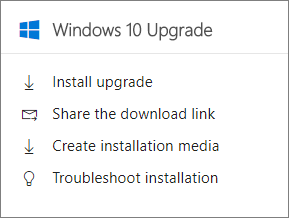

# Upgrade Windows devices to Windows Pro Creators Update

## Upgrade to Windows 10 Pro Creators update

1. Sign in to the [Microsoft admin center](https://portal.office.com/adminportal/home) and locate the **Windows 10 Upgrade** card. 
    
    
  
2. To upgrade to Windows 10 Pro Creators Update, you have several options. You can:
    
- Install the upgrade from the Microsoft Software Download site - Select this option if the device that you're logged in is on the same device as the one you want to update.
    
  a. Select **Install upgrade**.
    
  b. From the software download site, click **Update now** to start upgrading the device to Windows 10 Pro Creators Update. 
    
- Share the download link - Select this option if you want to send an email to people in your organization so they can upgrade to Windows 10 Pro by themselves.
 
   a. Select **Share the download** link to open an email that contains a link to the Windows software download site. 
    
 - Create an installation media using the Media Creation Tool - Select this option to create a Windows 10 Pro Creators Update installation media (USB flash drive or ISO file) to install Windows 10 on a PC that's different from the one you're using.
    
    a. Select **Create installation media**.
    
    b. Read the instructions on how to use the tool and create your installation media. 
    
See [Set up Windows devices for Microsoft 365 Business users](set-up-windows-devices.md) to complete setting up Windows 10 devices. 
  
See [Set up mobile devices for Microsoft 365 Business users](set-up-mobile-devices.md) to complete setting up Android and iOS devices. 
  
