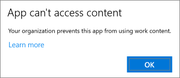
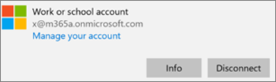
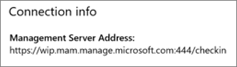

# Validate app protection settings on Windows 10 PCs

## Verify that users cannot copy company data to personal files on corporate devices

After you [set up app protection policies](protection-settings-for-windows-10-devices.md), it may take up to a few hours for the policy to take effect on users' devices. If you turned **On** the **Prevent users from copying company data to personal files and force them to save work files to OneDrive for Business** setting for company owned devices, you can check this on the user's device after they've connected to Azure AD and signed in. 
  
 **Verify connection settings**
  
1. After you sign in with Microsoft 365 Business Premium credentials and connect to Azure AD as described in [Set up Windows devices for Microsoft 365 Business Premium users](set-up-windows-devices.md), go to **Windows Settings** \> **Accounts** \> **Access work or school**. Choose **Connected to \<tenant name\> Azure AD**, and then choose **Info**.
    
    
  
2. On the **Managed by** \<tenant name\> page, you can see the **Connection info** that includes a **Management Server Address** like the one shown in the following figure. 
    
    
  
 **Verify that you cannot paste company data in a non-managed app**
  
1. Open Outlook 2016 that was installed by Microsoft 365 Business Premium.
    
2. Open an email and copy some content from it.
    
    Open Notepad and attempt to paste the content in.
    
    You'll receive an error that states the app can't access content.
    
    
  
    You can, however, paste the same content into Word 2016.
    
## Verify that users cannot copy company data to personal files on personal devices

 **Verify connection settings**
  
1. On your Windows 10 personal device where you're logged in as a local user, go to **Windows Settings**, and click or tap **Accounts** \> **Access work or school**.
    
2. Under the **Access work or school**, choose **Connect**.
    
3. Enter your Microsoft 365 Business Premium credential into the **Set up a work or school account dialog** \> **Sign in**.
    
4. On the **Access work or school** page, choose the **Work or school account**, and then choose **Info**.
    
    
  
5. On the **Access work or school** page, you can see the **Connection info** that includes a **Management Server Address** like the one shown in the following figure, and includes the words  *wip*  and  *mam*  within. 
    
    
  
 **Verify that you cannot paste company data in a non-managed app**
  
1. Open Outlook 2016 and add your Microsoft 365 Business Premium account if necessary and sign in with your Microsoft 365 Business Premium credentials.
    
2. Open an email and copy some content from it.
    
    Open Notepad and attempt to paste the content in.
    
    You'll receive an error that states App can't access content.
    
    
  
    You can, however, paste the same content into Word 2016.
    

