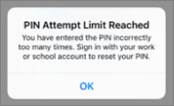

# Validate app protection settings on Android or iOS devices

Follow the instructions in the following sections to validate app protection settings on Android or iOS devices.
  
## Android
  
### Check that the app protection settings are working on user devices

After you [set app configurations for Android devices](app-protection-settings-for-android-and-ios.md) to protect the apps, you can follow these steps to validate that the settings you chose work. 
  
First, make sure that the policy applies to the app in which you're going to validate it.
  
1. In the Microsoft 365 Business Premium [admin center](https://portal.office.com), go to **Policies** \> **Edit policy**.
    
2. Choose **Application policy for Android** for the settings you created at setup, or another policy you created, and verify that it's enforced for Outlook, for example. 
    
    
  
### Validate Require a PIN or a fingerprint to access Office apps

In the **Edit policy** pane, choose **Edit** next to **Office documents access control**, expand **Manage how users access Office files on mobile devices**, and make sure that **Require a PIN or fingerprint to access Office apps** is set to **On**.
  

  
1. In the user's Android device, open Outlook and sign in with the user's Microsoft 365 Business Premium credentials.
    
2. You'll also be prompted to enter a PIN or use a fingerprint.
    
    
  
### Validate Reset PIN after number of failed attempts

In the **Edit policy** pane, choose **Edit** next to **Office documents access control**, expand **Manage how users access Office files on mobile devices**, and make sure that **Reset PIN after number of failed attempts** is set to some number. This is 5 by default. 
  
1. In the user's Android device, open Outlook and sign in with the user's Microsoft 365 Business Premium credentials.
    
2. Enter an incorrect PIN as many times as specified by the policy. You'll see a prompt that states **PIN Attempt Limit Reached** to reset the PIN. 
    
    
  
3. Press **Reset PIN**. You'll be prompted to sign in with the user's Microsoft 365 Business Premium credentials, and then required to set a new PIN.
    
### Validate Force users to save all work files to OneDrive for Business

In the **Edit policy** pane, choose **Edit** next to **Protection against lost or stolen devices**, expand **Protect work files when devices are lost or stolen**, and make sure that **Force users to save all work files to OneDrive for Business** is set to **On**.
  

  
1. In the user's Android device, open Outlook and sign in with the user's Microsoft 365 Business Premium credentials, and enter a PIN if requested.
    
2. Open an email that contains an attachment and tap the down arrow icon next to the attachment's information.
    
    
  
    You'll see **Cannot save to device** on the bottom of the screen. 
    
    
  
    > [!NOTE]
    > Saving to OneDrive for Business is not enabled for Android at this time, so you can only see that saving locally is blocked. 
  
### Validate Require user to sign in again if Office apps have been idle for a specified time

In the **Edit policy** pane, choose **Edit** next to **Office documents access control**, expand **Manage how users access Office files on mobile devices**, and make sure that **Require users to sign in again after Office apps have been idle for** is set to some number of minutes. This is 30 minutes by default. 
  
1. In the user's Android device, open Outlook and sign in with the user's Microsoft 365 Business Premium credentials, and enter a PIN if requested.
    
2. You should now see Outlook's inbox. Let the Android device idle untouched for at least 30 minutes (or some other amount of time, longer than what you specified in the policy). The device will likely dim.
    
3. Access Outlook on the Android device again.
    
4. You'll be prompted to enter your PIN before you can access Outlook again.
    
### Validate Protect work files with encryption

In the **Edit policy** pane, choose **Edit** next to **Protection against lost or stolen devices**, expand **Protect work files when devices are lost or stolen**, and make sure that **Protect work files with encryption** is set to **On**, and **Force users to save all work files to OneDrive for Business** is set to **Off**.
  
1. In the user's Android device, open Outlook and sign in with the user's Microsoft 365 Business Premium credentials, and enter a PIN if requested.
    
2. Open an email that contains a few image file attachments.
    
3. Tap the down arrow icon next to the attachment's info to save it.
    
    
  
4. You may be prompted to allow Outlook to access photos, media, and files on your device. Tap **Allow**.
    
5. At the bottom of the screen, choose to **Save to Device** and then open the **Gallery** app. 
    
6. You should see an encrypted photo (or more, if you saved multiple image file attachments) in the list. It may appear in the Pictures list as a gray square with a white exclamation point within a white circle in the center of the gray square.
    
    
  
## iOS
  
### Check that the App protection settings are working on user devices

After you [set app configurations for iOS devices](app-protection-settings-for-android-and-ios.md) to protect apps, you can follow these steps to validate that the settings you chose work. 
  
First, make sure that the policy applies to the app in which you're going to validate it.
  
1. In the Microsoft 365 Business Premium [admin center](https://portal.office.com), go to **Policies** \> **Edit policy**.
    
2. Choose **Application policy for iOS** for the settings you created at setup, or another policy you created, and verify that it's enforced for Outlook for example. 
    
    
  
### Validate Require a PIN to access Office apps

In the **Edit policy** pane, choose **Edit** next to **Office documents access control**, expand **Manage how users access Office files on mobile devices**, and make sure that **Require a PIN or fingerprint to access Office apps** is set to **On**.
  

  
1. In the user's iOS device, open Outlook and sign in with the user's Microsoft 365 Business Premium credentials.
    
2. You'll also be prompted to enter a PIN or use a fingerprint.
    
    
  
### Validate Reset PIN after number of failed attempts

In the **Edit policy** pane, choose **Edit** next to **Office documents access control**, expand **Manage how users access Office files on mobile devices**, and make sure that **Reset PIN after number of failed attempts** is set to some number. This is 5 by default. 
  
1. In the user's iOS device, open Outlook and sign in with the user's Microsoft 365 Business Premium credentials.
    
2. Enter an incorrect PIN as many times as specified by the policy. You'll see a prompt that states **PIN Attempt Limit Reached** to reset the PIN. 
    
    
  
3. Press **OK**. You'll be prompted to sign in with the user's Microsoft 365 Business Premium credentials, and then required to set a new PIN.
    
### Validate Force users to save all work files to OneDrive for Business

In the **Edit policy** pane, choose **Edit** next to **Protection against lost or stolen devices**, expand **Protect work files when devices are lost or stolen**, and make sure that **Force users to save all work files to OneDrive for Business** is set to **On**.
  

  
1. In the user's iOS device, open Outlook and sign in with the user's Microsoft 365 Business Premium credentials, and enter a PIN if requested.
    
2. Open an email that contains an attachment, open the attachment and choose **Save** on the bottom of the screen. 
    
    
  
3. You should only see an option for OneDrive for Business. If not, tap **Add Account** and select **OneDrive for Business** from the **Add Storage Account** screen. Provide the end user's Microsoft 365 Business Premium to sign in when prompted. 
    
    Tap **Save** and select **OneDrive for Business**.
    
### Validate Require user to sign in again if Office apps have been idle for a specified time

In the **Edit policy** pane, choose **Edit** next to **Office documents access control**, expand **Manage how users access Office files on mobile devices**, and make sure that **Require users to sign in again after Office apps have been idle for** is set to some number of minutes. This is 30 minutes by default. 
  
1. In the user's iOS device, open Outlook and sign in with the user's Microsoft 365 Business Premium credentials, and enter a PIN if requested.
    
2. You should now see Outlook's inbox. Let the iOS device untouched for at least 30 minutes (or some other amount of time, longer than what you specified in the policy). The device will likely dim.
    
3. Access Outlook on the iOS device again.
    
4. You'll be prompted to enter your PIN before you can access Outlook again.
    
### Validate Protect work files with encryption

In the **Edit policy** pane, choose **Edit** next to **Protection against lost or stolen devices**, expand **Protect work files when devices are lost or stolen**, and make sure that **Protect work files with encryption** is set to **On**, and **Force users to save all work files to OneDrive for Business** is set to **Off**.
  
1. In the user's iOS device, open Outlook and sign in with the user's Microsoft 365 Business Premium credentials, and enter a PIN if requested.
    
2. Open an email that contains a few image file attachments.
    
3. Tap the attachment and then tap the **Save** option under it. 
    
4. Open **Photos** app from the home screen. You should see an encrypted photo (or more, if you saved multiple image file attachments) saved, but encrypted. 
    
---

