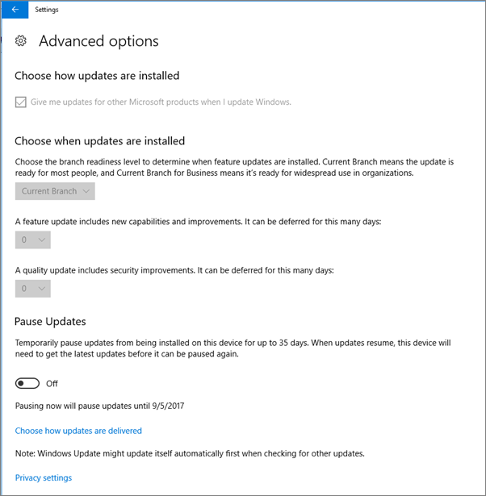

# Validate device protection settings on Windows 10 PCs

## Verify that Windows 10 device policies are set

After you [set up devices policies](protection-settings-for-windows-10-pcs.md), it may take up to a few hours for the policy to take effect on users' devices. You can confirm that the policies took effect by looking at various Windows Settings screens on the users' devices. Because the users won't be able to modify the Windows Update and Windows Defender Antivirus settings on their Windows 10 devices, many options will be grayed out.
  
1. Go to **Settings** \> **Update &amp; security** \> **Windows Update** \> **Restart options** and confirm that all settings are grayed out. 
    
    
  
2. Go to **Settings** \> **Update &amp; security** \> **Windows Update** \> **Advanced options** and confirm that all settings are grayed out. 
    
    
  
3. Go to **Settings** \> **Update &amp; security** \> **Windows Update** \> **Advanced options** \> **Choose how updates are delivered**.
    
    Confirm that you can see the message (in red) that some settings are hidden or managed by your organization, and all the options are grayed out.
    
    
  
4. To open the Windows Defender Security Center, go to **Settings** \> **Update &amp; security** \> **Windows Defender** \> click **Open Windows Defender Security Center** \> **Virus &amp; thread protection** \> **Virus &amp; threat protection settings**. 
    
5. Verify that all options are grayed out. 
    
    
  
## Related Topics

[Microsoft 365 for business documentation and resources](./index.yml)
  
[Get started with Microsoft 365 for business](microsoft-365-business-overview.md)
  
[Manage Microsoft 365 for business](manage.md)
  
[Set device configurations for Windows 10 PCs](protection-settings-for-windows-10-pcs.md)
