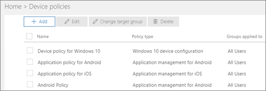
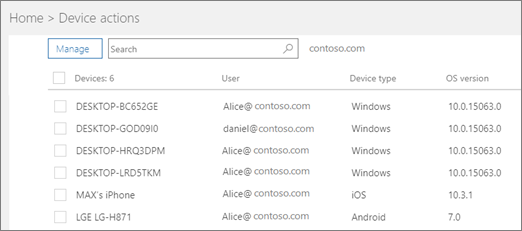

# View policies and devices

## View device policies

1. Sign in to [Microsoft 365 Business](https://portal.office.com) with global admin credentials. 
    
2. On the left nav, choose **Devices** \> **Policies** \> **Add**.
    
    On this page you can create, edit, change target group, or delete a policy.
    
    
  
## View device actions

1. Sign in to [Microsoft 365 Business](https://portal.office.com) with global admin credentials. 
    
2. In the admin center, on the **Device actions** card, choose **Device actions** to open the **Device actions** page. 
    
    On this page you can select one or more devices and either remove company data. For Windows 10 devices that you have set device protections settings for, you can also choose to reset the device to factory settings.
    
    
  
  

