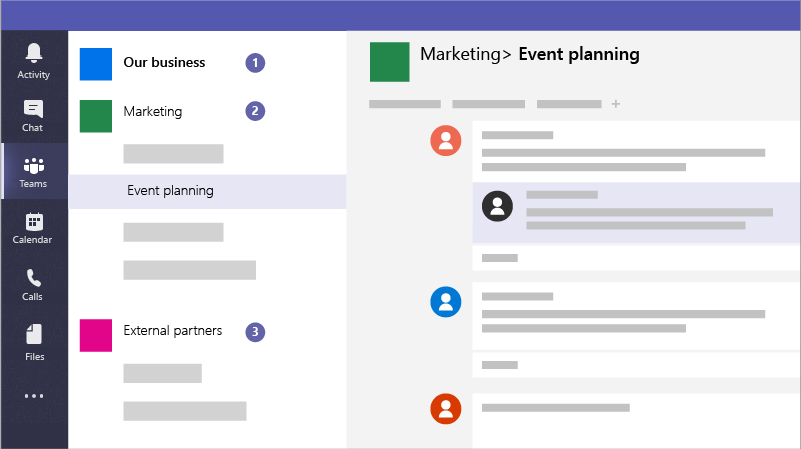

# Create teams for collaboration in Microsoft Teams

Microsoft Teams is a collaboration app that helps your staff stay organized and have conversations, from any device. You can use Microsoft Teams to have instant conversations with members of your staff or guests outside your organization. You can also make phone calls, host meetings, and share files.

## Best practices

1. Create private teams for sensitive information.
1. Create an org-wide team for communication with everyone across your organization.
1. Create teams for specific projects and apply the right amount of protection based on who should be included.
1. Create specific teams for communication with external partners to keep them separate from anything sensitive for your business.

For example, a business, legal firm, or healthcare practice could create the following teams:

1. **A business-, firm-, or practice-wide team:** This is for everyone to use for day to day communications and work across your business. You can use this team to post announcements or share information of interest for your whole firm or practice.
1. **Individual teams:** Set up teams for smaller groups to collaborate about their day to day work.
1. **An external communications team or teams:** Coordinate with your vendors, partners, or clients without allowing them into anything sensitive. Set up different channels for specific groups.

And campaigns could create the following teams to communicate and collaborate securely:

1. **A campaign Leads team:** Set this up as a private team so that only your key campaign members can access it and discuss potentially sensitive concerns.
2. **A general campaign team:** This is for everyone to use for day to day communications and work. Individuals, groups, or committees can set up channels in this team to do their work. For example, the event planning people can set up a channel to chat and coordinate logistics for campaign events.
3. **A partners team:** Coordinate with your vendors, partners, or volunteers without allowing them into anything sensitive.

When you create a team, here's what else gets created:

- A new [Microsoft 365 group](/MicrosoftTeams/office-365-groups)
- A [SharePoint Online](/MicrosoftTeams/sharepoint-onedrive-interact) site and document library to store team files
- An [Exchange Online](/MicrosoftTeams/exchange-teams-interact) shared mailbox and calendar
- A OneNote notebook
- Ties into other Office 365 apps such as Planner and Power BI

Inside Microsoft Teams, you can find:

1. **Teams:** Find channels to belong to or create your own. Inside channels you can hold on-the-spot meetings, have conversations, and share files.
2. **Meetings:** See everything you've got lined up for the day or week. Or, schedule a meeting. This calendar syncs with your Outlook calendar.
3. **Calls:** In some cases, if your organization has it set up, you can call anyone from Microsoft Teams, even if they're not using Microsoft Teams.
4. **Activity:** Catch up on all your unread messages, @mentions, replies, and more.

Use the command box at the top to search for specific items or people, take quick actions, and launch apps.

## Set it up

Create a private team for just the business owner and managers, or campaign manager and candidate like this.

> [!VIDEO https://www.microsoft.com/videoplayer/embed/RWeqWA]

Create an organization-wide team that everyone in the business or campaign can use to communicate and share files.

> [!VIDEO https://www.microsoft.com/videoplayer/embed/RE2GCG9]

Create a team that you share with guests outside your organization, such as for advertising or finances.

> [!VIDEO https://www.microsoft.com/videoplayer/embed/RE1FQMp]

Learn more about Microsoft Teams at [Microsoft Teams technical documentation](/microsoftteams/microsoft-teams)

## Admin settings

You must be an admin to create an organization-wide team. For more information, see [What is an Admin in Microsoft 365?](https://support.office.com/article/what-is-an-admin-e123627e-4892-4461-b9aa-1b6d57a5cfa4?ui=en-US&rs=en-US&ad=US).