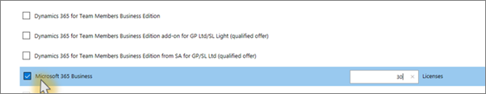

# Microsoft 365 for Campaigns
If your campaign (or campaign support organization) needs cybersecurity protection, this is the least expensive Microsoft plan available. 
Organizations that run (or support) campaigns and those that support elected staff are usually eligible. This topic has: 
- More details about who can get Microsoft 365 for Campaigns, 
- What it includes, how much it costs, and what your commitment is
- How to get started

There are several ways to get Microsoft 365 Business.
## Who can get Microsoft 365 for Campaigns? 
Microsoft 365 for Campaigns is available to campaigns, candidates, elected officials, and support organizations based in the USA. You can use Microsoft 365 for Campaigns if you:
- Are a current candidate (or a representative) running for federal, state, or local office in the United States. 
- Represent a campaign organization for a sitting member of Congress.
- Represent a national or state party committee.
- Are a technology vendor who primarily serves campaigns and committees.
- Are a nonprofit organization or nongovernmental organization that primarily serves campaigns and committees. 

## What does it include?
Microsoft 365 for Campaigns includes....

## Get Microsoft 365 Business from Microsoft 
## What does it cost, who needs it, and what is the commitment?
Microsoft 365 for Campaigns costs $5 per user per month. 
To protect your campaign or business, we recommend a license for the candidate, all senior staff who are part of the campaign including the campaign manager, and usually all full-time staff. Very strategic volunteer employees might also need a license. In general, anyone who needs protected email and devices should have a license.
There is no commitment. You can pay monthly for the licenses you need and stop using the service any time.

## How to get Microsoft 365 for Campaigns

1. Provide some details about your organization at https://m365forcampaigns.microsoft.com/. There's no commitment when you complete this form. The details you provide will help us verify that eligibility and that you're based in the United States.
2. After you've completed the form, it takes us a few days to check that you're eligible Microsoft 365 for Campaigns. 
3. Once we've verified your details, you'll receive an email from Microsoft that includes a sign-up location and code specific to your organization. 

  
## Get Microsoft 365 Business from Microsoft Partner Center

1. Sign in at [Microsoft Partner Center](https://go.microsoft.com/fwlink/p/?linkid=849910) by using the credentials you created when you enrolled to the Cloud Service Provider (CSP) program. 
    
2. On the Partner Dashboard, choose Customers, then select your customer or add a new customer before you get Microsoft 365 Business.
    
    
  
3. On the customer's **Subscription** page, select Add subscription, choose the Small business option under Catalog, and then choose **Microsoft 365 Business**.
    
    
    Select the number of licenses you need (up to 300). If you have more than 300 users, see [Microsoft 365 Enterprise](https://go.microsoft.com/fwlink/p/?linkid=862316) instead. 
    
    
 
  
    Complete the rest of the steps for adding a new customer including the business name.
    

