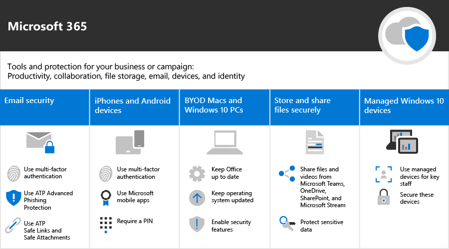
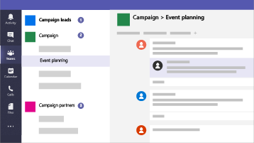
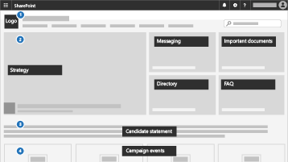

Microsoft 365 for smaller businesses and campaigns
===========================

If you have Microsoft 365 Business Premium, the guidance in this library is the quickest way to setup security and begin collaborating safely. In our current world, keeping data and communications secure is a priority, particularly for medical and legal practices, political campaigns, and many other smaller businesses. This solution provides a set of recommendations designed to help protect you and your data. This library includes help for setting up and using this recommended environment, no matter your business type.

This configuration includes the following guidance for productivity, collaboration, file storage, email, devices, and identity to protect your business:

| Protection for | Description | Links |
| ----- | ----- | ----- | ----- |
|Email | Use multi-factor authentication, and ATP Advanced Phishing Protection, and ATP Safe Links and Safe Attachments, and use encrypted email for sensitive information.| [Set up multi-factor authentication](m365-campaigns-multifactor-authenication.md), [Protect against phishing attacks](m365-campaigns-phishing-and-attacks.md), [Encrypt or label your sensitive email](send-encrypted-email.md) |
|iPhones and Android devices |Use multi-factor authentication, and set up Microsoft mobile apps, and require a PIN | [Set up multi-factor authentication](m365-campaigns-multifactor-authenication.md), [Set up mobile devices](../business/set-up-mobile-devices.md?toc=/microsoft-365/campaigns/toc.json)|
|Bring-your-own-devices (BYOD) Macs and Windows 10 PCs |Keep Office up to date, keep operating systems updated, and enable security features. | [Protect unmanaged Windows 10 PCs and Macs](m365-campaigns-protect-pcs-macs.md) |
|Storing and sharing files securely | Share files and videos from Microsoft Teams, OneDrive, SharePoint, and Microsoft Stream, and protect sensitive data.| [Share files and videos](share-files-and-videos.md) |
|Managed Windows 10 devices |Use managed devices for key staff and secure these devices. | [Set up managed devices](../business/set-up-windows-devices.md?toc=/microsoft-365/campaigns/toc.json) |

A recommended security configuration for Microsoft 365 Business Premium
------------------------------------

This recommended secure configuration for Microsoft 365 Business Premium lets you:

- Rely on trusted business productivity and collaboration tools, such as Outlook, Word, Excel, and other Office products.
- Protect your work files on all of your iOS, Android, and Windows 10 devices with enterprise-grade security that is simple to manage.
- Apply extra protection for user accounts and identity.

> [!VIDEO https://www.microsoft.com/videoplayer/embed/RE3clbH]

While federal and some state election campaigns in the United States qualify for [special pricing](get-microsoft-365-campaigns.md) for the Microsoft 365 for Campaigns offering of Microsoft 365 Business Premium, any organization with the Business Premium plan can take advantage of this guidance to configure increased security and learn how to collaborate securely.

This library includes the following:

- Prescriptive setup guidance for adding increased security.
- Help for users to setup devices for secure access.
- Guidance on how to collaborate and share securely.

For more information about what's included, see [Microsoft 365 Business Premium](https://www.microsoft.com/microsoft-365/business).

Get started
--------------------------

Follow these steps to get started:

- For campaigns: [Get Microsoft 365 campaigns](get-microsoft-365-campaigns.md)
- For any business: [Learn how your users will work with Microsoft 365](m365-campaigns-users.md)
- For any business: [Set up Microsoft 365](microsoft-365-campaigns-setup-overview.md)

Solutions for your business
--------------------------

After you set up your secure Microsoft 365 environment, you can use the following solutions to get working:

| Create teams for collaboration | Set up online meetings |
| ------------- | ------------- |
|  |  |
| Collaborate with teams for key staff, all staff, and partners or vendors. [Create your team](create-teams-for-collaboration.md) | Schedule a meeting with audio, video, and sharing with Microsoft Teams. [Set up a meeting](set-up-meetings.md) |

| Encrypt or label your sensitive email | Create a communications site |
| ------------- | ------------- |
|  |  |
| Use encryption and sensitivity labels to protect email that contains confidential or sensitive information. [Send encrypted email](send-encrypted-email.md) | Share events, message, images, and more with your team in an internal communications site created with SharePoint. [Create your site](create-communications-site.md) |

| Share files and videos |
| ------------- |
|  |
| Save your files and videos to the cloud so they're available  to all of the appropriate people. [Start sharing](share-files-and-videos.md) |
