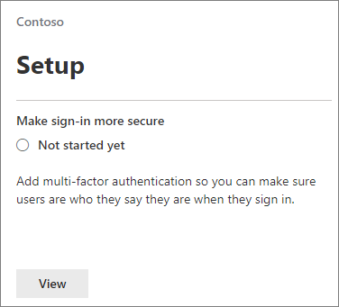

# Require multi-factor authentication and set up conditional access policies

You protect access to your data with multi-factor authentication and conditional access policies. These add substantial additional security. Microsoft provides a set of baseline conditional access policies that are recommended for all customers. Baseline policies are a set of predefined policies that help protect organizations against many common attacks. These common attacks can include password spray, replay, and phishing.

These policies require admins and users to enter a second form of authentication (called multi-factor authentication, or MFA) under certain conditions. For example, if a user in your organization tries to sign in to Microsoft 365 from a different country or from an unknown device, the sign-in might be considered risky. The user must provide an extra form of authentication (such as a fingerprint or a code) to prove their identity.

Currently, the baseline policies include the following policies:

- Set up in Microsoft 365 admin center:
  - **Require MFA for admins**: Requires multi-factor authentication for the most privileged administrator roles, including global administrator.
  - **End-user protection**: Requires multi-factor authentication for users only when a sign-in is risky. 
- Set up in Azure Active Directory portal:
  - **Block legacy authentication**: Older client apps and some new apps don't use newer, more secure, authentication protocols. These older apps can bypass conditional access policies and gain unauthorized access to your environment. This policy blocks access from clients that don't support conditional access. 
  - **Require MFA for Service Management**: Requires multi-factor authentication for access to management tools, including Azure portal (where you configure baseline policies).

We recommend that you enable all of these baseline policies. After these policies are enabled, admins and users will be prompted to register for Azure AD Multifactor Authentication.

For more information about these policies, see [What are baseline policies](https://docs.microsoft.com/azure/active-directory/conditional-access/concept-baseline-protection)?

## Require MFA

To require that all users sign in with a second form of ID:

1. Go to the admin center at <a href="https://go.microsoft.com/fwlink/p/?linkid=837890" target="_blank">https://admin.microsoft.com</a> and choose **Setup**.

2. On the Setup page, choose **View** in the **Make sign-in more secure** card.

    
3. On the Make sign-in more secure page, choose **Get started**.

4. On the Strengthen sign-in security pane, select the check boxes next to **Require multi-factor authentication for admins** and **Require users to register for multi-factor authentication and block access if risk is detected**.
    Be sure to exclude the [emergency](m365-campaigns-protect-admin-accounts.md#create-an-emergency-admin-account) or "break-glass" admin account from the MFA requirement in the **Find users** box.

    

5. Choose **Create policy** on the bottom of the page.

## Set up baseline policies

1. Go to the [Azure portal](https://portal.azure.com), and then navigate to **Azure Active Directory** \> **Conditional Access** to create a **new policy**.

See the following specific instructions for each policy:  
    - [Require MFA for admins](https://docs.microsoft.com/azure/active-directory/conditional-access/howto-baseline-protect-administrators)  
    - [Require MFA for users](https://docs.microsoft.com/azure/active-directory/conditional-access/howto-baseline-protect-end-users)  
    - [Block legacy authentication](https://docs.microsoft.com/azure/active-directory/conditional-access/howto-baseline-protect-legacy-auth)  
    - [Require MFA for service management](https://docs.microsoft.com/azure/active-directory/conditional-access/howto-baseline-protect-azure)

> [!NOTE]
> Preview policies no longer exist and users will need to create their own policies.

You can set up extra policies, such as requiring approved client apps. For more information, see the [Conditional Access documentation](https://docs.microsoft.com/azure/active-directory/conditional-access/).
