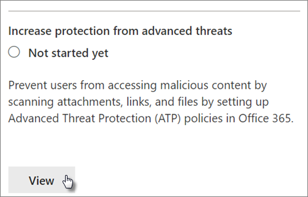
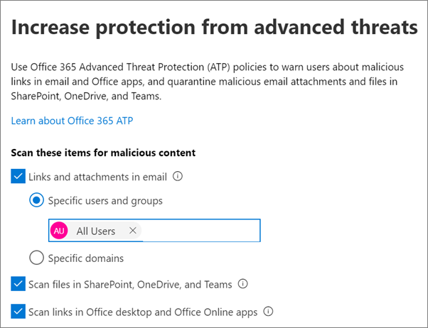
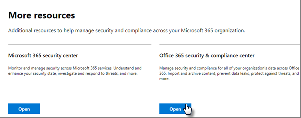
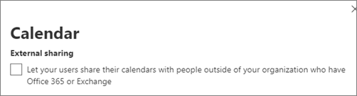

# Increase threat protection for Microsoft 365 subscription

This article helps you increase the protection in your Microsoft 365 subscription to protect against phishing, malware, and other threats. These recommendations are appropriate for organizations with an increased need for security, like political campaigns, law offices, and health care clinics.

Before you begin, check your Microsoft Secure Score. Microsoft Secure Score analyzes your organization's security based on your regular activities and security settings and assigns a score. Begin by taking note of your current score. Taking the actions recommended in this article increases your score. The goal isn't to achieve the max score, but to be aware of opportunities to protect your environment that don't negatively affect productivity for your users.

For more information, see [Microsoft Secure Score](../security/defender/microsoft-secure-score.md).

## Raise the level of protection against malware in mail

Your Office 365 or Microsoft 365 environment includes protection against malware, but you can increase this protection by blocking attachments with file types that are commonly used for malware. To bump up malware protection in email:

1. Go to <https://protection.office.com> and sign in with your admin account credentials.

2. In the Security & Compliance Center, in the left navigation pane, under **Threat management**, choose **Policy** \> **Anti-Malware**.

3. Double-click the default policy to edit this company-wide policy.

4. Click **Settings**.

5. Under **Common Attachment Types Filter**, select **On**. The file types that are blocked are listed in the window directly below this control. Make sure you add these filetypes:

   `ade, adp, ani, bas, bat, chm, cmd, com, cpl, crt, hlp, ht, hta, inf, ins, isp, job, js, jse, lnk, mda, mdb, mde, mdz, msc, msi, msp, mst, pcd, reg, scr, sct, shs, url, vb, vbe, vbs, wsc, wsf, wsh, exe, pif`

   You can add or delete file types later, if needed.

6. Click **Save.**

For more information, see [Anti-malware protection in EOP](../security/office-365-security/anti-malware-protection.md).

## Protect against ransomware

Ransomware restricts access to data by encrypting files or locking computer screens. It then attempts to extort money from victims by asking for "ransom," usually in the form of cryptocurrencies like Bitcoin, in exchange for access to data.

You can protect against ransomware by creating one or more mail flow rules to block file extensions that are commonly used for ransomware (these were added in the [raise the level of protection against malware in mail](#raise-the-level-of-protection-against-malware-in-mail) step), or to warn users who receive these attachments in email.

In addition to the files that you blocked in the previous step, it's also good practice to create a rule to warn users before opening Office file attachments that include macros. Ransomware can be hidden inside macros, so warn users to not open these files from people they don't know.

To create a mail transport rule:

1. Go to the admin center at <https://admin.microsoft.com> and choose **Admin centers** \> **Exchange**.

2. In the **mail flow** category, click **rules**.

3. Click **+**, and then click **Create a new rule**.

4. Click **More options** at the bottom of the dialog box to see the full set of options.

5. Apply the settings in the following table for the rule. Leave the rest of the settings at the default, unless you want to change them.

6. Click **Save**.

|Setting|Warn users before opening attachments of Office files|
|---|---|
|Name|Anti-ransomware rule: warn users|
|Apply this rule if . . .|Any attachment . . . file extension matches . . .|
|Specify words or phrases|Add these file types:   `dotm, docm, xlsm, sltm, xla, xlam, xll, pptm, potm, ppam, ppsm, sldm`|
|Do the following . . .|Notify the recipient with a message|
|Provide message text|Do not open these types of files from people you do not know because they might contain macros with malicious code.|

For more information, see:

- [Ransomware: how to reduce risk](https://www.microsoft.com/security/blog/2020/04/28/ransomware-groups-continue-to-target-healthcare-critical-services-heres-how-to-reduce-risk/)

- [Restore your OneDrive](https://support.microsoft.com//office/fa231298-759d-41cf-bcd0-25ac53eb8a15)

## Stop auto-forwarding for email

Hackers who gain access to a user's mailbox can steal your mail by setting the mailbox to automatically forward email. This can happen even without the user's awareness. You can prevent this from happening by configuring a mail flow rule.

To create a mail transport rule, either watch [this short video](https://support.office.com/article/f9d693ba-5c78-47c0-b156-8e461e062aa7) or follow these steps:

1. In the Microsoft 365 admin center, click **Admin centers** \> **Exchange**.

2. In the **mail flow** category, click **rules**.

3. Click **+**, and then click **Create a new rule**.

4. Click **More options** at the bottom of the dialog box to see the full set of options.

5. Apply the settings in the following table. Leave the rest of the settings at the default, unless you want to change them.

6. Click **Save**.

|Setting|Warn users before opening attachments of Office files|
|---|---|
|Name|Prevent auto forwarding of email to external domains|
|Apply this rule if ...|The sender . . . is external/internal . . . Inside the organization|
|Add condition|The message properties . . . include the message type . . . Auto-forward|
|Do the following ...|Block the message . . . reject the message and include an explanation.|
|Provide message text|Auto-forwarding email outside this organization is prevented for security reasons.|

## Protect your email from phishing attacks

If you've configured one or more custom domains for your Office 365 or Microsoft 365 environment, you can configure targeted anti-phishing protection. Anti-phishing protection, part of Microsoft Defender for Office 365, can help protect your organization from malicious impersonation-based phishing attacks and other phishing attacks. If you haven't configured a custom domain, you don't need to do this.

We recommend that you get started with this protection by creating a policy to protect your most important users and your custom domain.

To create an anti-phishing policy in Defender for Office 365, watch [this short training video](https://support.office.com/article/86c425e1-1686-430a-9151-f7176cce4f2c), or complete the following steps:

1. Go to <https://protection.office.com>.

2. In the Security & Compliance Center, in the left navigation pane, under **Threat management**, choose **Policy**.

3. On the **Policy** page, choose **Anti-phishing**.

4. On the **Anti-phishing** page, select **+ Create**. A wizard launches that steps you through defining your anti-phishing policy.

5. Specify the name, description, and settings for your policy as recommended in the chart below. For more information, see [Learn about anti-phishing policy in Microsoft Defender for Office 365 options](../security/office-365-security/set-up-anti-phishing-policies.md).

6. After you've reviewed your settings, choose **Create this policy** or **Save**, as appropriate.

|Setting or option|Recommended setting|
|---|---|
|Name|Domain and most valuable staff|
|Description|Ensure most important staff and our domain are not being impersonated.|
|Add users to protect|Select **+ Add a condition, The recipient is**. Type user names or enter the email address of the business owners, partners, or candidate, managers, and other important staff members. You can add up to 20 internal and external addresses that you want to protect from impersonation.|
|Add domains to protect|Select **+ Add a condition, The recipient domain is**. Enter the custom domain associated with your Microsoft 365 subscription, if you defined one. You can enter more than one domain.|
|Choose actions|If email is sent by an impersonated user: Choose **Redirect message to another email address**, and then type the email address of the security administrator; for example, *Alice@contoso.com*.   If email is sent by an impersonated domain: Choose **Quarantine message**.|
|Mailbox intelligence|By default, mailbox intelligence is selected when you create a new anti-phishing policy. Leave this setting **On** for best results.|
|Add trusted senders and domains|Here you can add your own domain, or any other trusted domains.|
|Applied to|Select **The recipient domain is**. Under **Any of these**, select **Choose**. Select **+ Add**. Select the check box next to the name of the domain, for example, *contoso.com*, in the list, and then select **Add**. Select **Done**.|

For more information, see [Set up anti-phishing policies in Defender for Office 365](../security/office-365-security/set-up-anti-phishing-policies.md).

## Protect against malicious attachments, files, and links with Defender for Office 365

First, make sure, in the admin center at <https://admin.microsoft.com> that you have the new admin center preview turned on. Turn on the toggle next to the text **The new admin center**.

   

If you don't see the **Setup** page with cards in your tenant yet, see how to complete these steps in Security & Compliance Center. See [Set up Safe Attachments in the Security & Compliance Center](#set-up-safe-attachments-in-the-security--compliance-center) and [Set up Safe Links in the Security & Compliance Center](#set-up-safe-links-in-the-security--compliance-center).

1. In the left nav, choose **Setup**.
2. On the **Setup** page, choose **View** on the **Increase protection from advanced threats** card.

   

3. On the **Increase protection from advanced threats** page, choose **Get started**.
4. On the pane that opens, select the check boxes next to **Links and attachments in email**, **Scan files in SharePoint, OneDrive, and Teams**, and **Scan links in Office desktop and Office Online apps** under **Scan items for malicious content**.

   Under **Links and attachments in email**, Type in All Users, or the specific users whose email you want scanned.

   

5. Choose **Create policies** to turn on Safe Attachments and Safe Links.

### Set up Safe Attachments in the Security & Compliance Center

People regularly send, receive, and share attachments, such as documents, presentations, spreadsheets, and more. It's not always easy to tell whether an attachment is safe or malicious just by looking at an email message. Microsoft Defender for Office 365 includes Safe Attachment protection, but this protection is not turned on by default. We recommend that you create a new rule to begin using this protection. This protection extends to files in SharePoint, OneDrive, and Microsoft Teams.

To create an Safe Attachment policy, either watch [this short video](https://support.office.com/article/e7e68934-23dc-4b9c-b714-e82e27a8f8a5), or complete the following steps:

1. Go to <https://protection.office.com> and sign in with your admin account.

2. In the Security & Compliance Center, in the left navigation pane, under **Threat management**, choose **Policy**.

3. On the Policy page, choose **Safe Attachments**.

4. On the Safe attachments page, apply this protection broadly by selecting the **Turn on ATP for SharePoint, OneDrive, and Microsoft Teams** check box.

5. Select **+** to create a new policy.

6. Apply the settings in the following table.

7. After you review your settings, choose **Create this policy** or **Save**, as appropriate.

|Setting or option|Recommended setting|
|---|---|
|Name|Block current and future emails with detected malware.|
|Description|Block current and future emails and attachments with detected malware.|
|Save attachments unknown malware response|Select **Block - Block the current and future emails and attachments with detected malware**.|
|Redirect attachment on detection|Enable redirection (select this box)   Enter the admin account or a mailbox setup for quarantine.   Apply the above selection if malware scanning for attachments times out or error occurs (select this box).|
|Applied to|The recipient domain is . . . select your domain.|

For more information, see [Set up anti-phishing policies in Defender for Office 365](../security/office-365-security/set-up-anti-phishing-policies.md).

### Set up Safe Links in the Security & Compliance Center

Hackers sometimes hide malicious websites in links in email or other files. Safe Links, part of Microsoft Defender for Office 365, can help protect your organization by providing time-of-click verification of web addresses (URLs) in email messages and Office documents. Protection is defined through Safe Links policies.

We recommend that you do the following:

- Modify the default policy to increase protection.

- Add a new policy targeted to all recipients in your domain.

To set up Safe Links, watch [this short training video](https://support.office.com/article/61492713-53c2-47da-a6e7-fa97479e97fa), or complete the following steps:

1. Go to <https://protection.office.com> and sign in with your admin account.

2. In the Security & Compliance Center, in the left navigation pane, under **Threat management**, choose **Policy**.

3. On the Policy page, choose **Safe Links**.

To modify the default policy:

1. On the Safe links page, under **Policies that apply to the entire organization**, select the **Default** policy.

2. Under **Settings that apply to content except email**, select **Microsoft 365 Apps for enterprise, Office for iOS and Android**.

3. Click **Save**.

To create a new policy targeted to all recipients in your domain:

1. On the Safe links page, under **Policies that apply to the entire organization**, click **+** to create a new policy.

2. Apply the settings listed in the following table.

3. Click **Save**.

|Setting or option|Recommended setting|
|---|---|
|Name|Safe links policy for all recipients in the domain|
|Select the action for unknown potentially malicious URLs in messages|Select **On - URLs will be rewritten and checked against a list of known malicious links when user clicks on the link**.|
|Use Safe Attachments to scan downloadable content|Select this box.|
|Applied to|The recipient domain is . . . select your domain.|

For more information, see [Safe Links in Defender for Office 365](../security/office-365-security/safe-links.md).

## Turn on the Unified Audit Log

After you turn on the audit log search in the Security & Compliance Center, you can retain the admin and other user activity in the log and search it.

You must be assigned the Audit Logs role in Exchange Online to turn audit log search on or off in your Microsoft 365 subscription. By default, this role is assigned to the Compliance Management and Organization Management role groups on the Permissions page in the Exchange admin center. Global admins in Microsoft 365 are members of this group by default.

1. To turn on the audit log search, go to the admin center at <https://admin.microsoft.com> and then choose **Security** under **Admin centers** in the left nav.
2. On the **Microsoft 365 Security** page, choose **More resources**, and then **Open** on the **Office 365 Security & Compliance Center** card.

    
3. On the security and compliance page, choose **Search** and then **Audit log search**.
4. On the top of the **Audit log search** page, choose **Turn on auditing**.

After the feature is turned on, you can search for files, folders, and many activities. For more information, see [search the audit log](../compliance/search-the-audit-log-in-security-and-compliance.md).

## Tune-up anonymous sharing settings for SharePoint and OneDrive files and folders

(change default anonymous link expiration to 14 days, change default sharing type to "Specific People")
To change the sharing settings for OneDrive and SharePoint:

1. Go to the admin center at <https://admin.microsoft.com> and then choose **SharePoint** under **Admin centers** in the left nav.
2. In the SharePoint admin center, go to **Policies** \> **Sharing**.
3. On the **Sharing** page, under **File and folder links**, select **Specific people**, and under **Advanced settings for "Anyone" links**, select **These links must expire within this many days**, and type in 14 (or another number of days you want to restrict the link lifetime to).

   

## Activity alerts

You can use activity alerts to track admin and user activities and detect malware and data loss prevention incidents in your organization. Your subscription includes a set of default policies, but you can also create custom ones. For more information, see [alert policies](../compliance/alert-policies.md). For example, if you store an important file in SharePoint that you don't want anyone to share externally, you can create a notification that alerts you if someone does share it.

The following figure shows the default policies that are included with Microsoft 365.

## Disable or manage calendar sharing

You can prevent people in your organization from sharing their calendars, or you can also manage what they can share. For example, you can restrict the sharing to free/busy times only.

1. Go to the admin center at <https://admin.microsoft.com> and choose **Settings** \> **Org Settings**.
2. On the **Services** page, choose **Calendar**, and choose whether people in your organization can share their calendars with people outside who have Office 365 or Exchange, or with anyone.

   If you choose the share with anyone option, you can decide to also only share free/busy information.

3. Choose **Save changes** on the bottom of the page.

   The following figure shows calendar sharing not allowed.

   

   The following figure shows the settings when calendar sharing is allowed with an email link with only free/busy information.

   

If your users are allowed to share their calendars, see [these instructions](https://support.office.com/article/7ecef8ae-139c-40d9-bae2-a23977ee58d5) for how to share from Outlook on the web.
