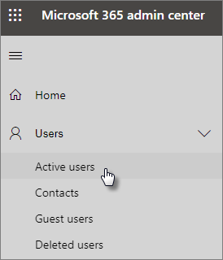
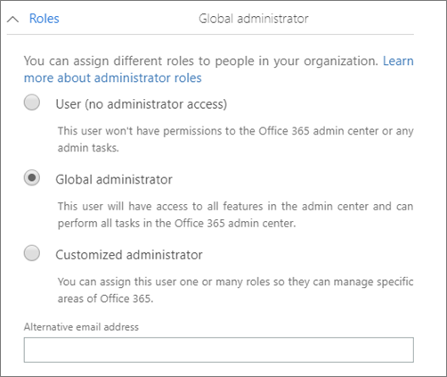

# Protect your administrator accounts

Because admin accounts come with elevated privileges, they're valuable targets for hackers and cyber criminals. This article describes:

- How to set up an additional administrator account for emergencies.
- How to protect these accounts.

When you sign up for Microsoft 365 and enter your information, you automatically become the Global admin. A Global admin has the ultimate control of user accounts and all the other settings in the Microsoft admin center, but there are many different kinds of admin accounts with varying degrees of access. See [about admin roles](/office365/admin/add-users/about-admin-roles) for information about the different access levels for each kind of admin role.

## Create additional admin accounts

Use admin accounts only for administration. Admins should have a separate user account for regular use of Office apps and only use their administrative account when necessary to manage accounts and devices, and while working on other admin functions. It's also a good idea to remove the Microsoft 365 license from the admin accounts so you don't have to pay for them.

You'll want to set up at least one additional Global admin account to give admin access to another trusted employee. You can also create separate admin accounts for user management (this role is called **User management administrator**). For more information, see [about admin roles](/office365/admin/add-users/about-admin-roles).

To create additional admin accounts:

 1. Go to the <a href="https://go.microsoft.com/fwlink/p/?linkid=837890" target="_blank">admin center</a> and then choose **Users** \> **Active users** in the left nav.

    

 2. On the **Active users** page, select **Add a user** at the top of the page, and on the **New user** panel, enter the name and other information.
 3. Expand the **Roles** section, and choose **Global administrator** to give this user global admin access. You can also choose **Customized administrator** and choose any of the roles that are displayed.

    Enter an alternate email in the **Alternative email address** text box. You can use this address to recover your password information if you get locked out. For Global admins, a billing statement will also be sent to this address.

    

 4. In the **Product licenses** section, move the selector for **Microsoft 365 Business** to **Off** and the **Create user without product license** to **On**.

    

## Create an emergency admin account

You should also create a backup account that isn't set up with multi-factor authentication (MFA) so you don't accidentally lock yourself out (for example if you lose your phone that you're using as a second form of verification). Make sure that the password for this account is a phrase or at least 16 characters long. This is often referred to as a "break-glass account."

## Create a user account for yourself

Use your user account to participate in collaboration with your organization, including checking mail. This means your admin credentials might be similar to  *Alice.Chavez@Contoso.org* and your regular user account might be similar to *Alice@Contoso.com*.

To create a new user account:

1. Go to the <a href="https://go.microsoft.com/fwlink/p/?linkid=837890" target="_blank">admin center</a> and then choose **Users** \> **Active users** in the left nav.
2. On the **Active users** page, select **Add a user** at the top of the page, and on the **New user** panel, enter the name and other information.
3. Expand the **Roles** section, and choose **User (no administrative access)**.
4. In the **Product licenses** section, move the selector for **Microsoft 365 Business** to **On**.

## Turn on security defaults

Security defaults help protect your organization from identity-related attacks by providing preconfigured security settings that Microsoft manages on behalf of your organization. These settings include enabling multi-factor authentication (MFA) for all admins and user accounts. For more information about security defaults and to learn how to enable them on, see [Turn on security defaults](m365-campaigns-conditional-access.md).

## Additional recommendations

- Before using admin accounts, close out all unrelated browser sessions and apps, including personal email accounts. You can also use in private, or incognito browser windows.
- After completing admin tasks, be sure to sign out of the browser session.
