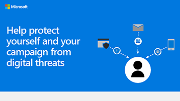

## Infographic: Help protect yourself and your campaign from digital threats 
The links for PowerPoint and PDF below can be downloaded and printed in tabloid format (also known as ledger, 11 x 17, or A3).

[PDF](downloads/M365-Campaigns-WhatCanUsersDoToSecure.pdf) | [PowerPoint](https://github.com/MicrosoftDocs/microsoft-365-docs/raw/public/microsoft-365/downloads/M365-Campaigns-WhatCanUsersDoToSecure.pptx)
