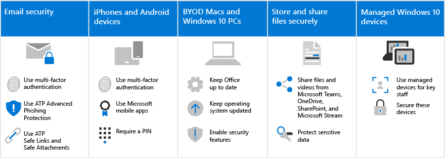

# How these security recommendations affect your users

The security recommendations for Microsoft 365 in this solution make it much harder for hackers to gain access to your environment. The tradeoff is that your users will need to be aware of how to work within this more secure environment. We understand a little extra patience is required, but it's worth it to keep your organization protected.

## Use secure email practices

All users should be aware of and use these email practices to help keep their email secure:

- Set up email to use multi-factor authentication with the authenticator app.
- Verify legitimate emails and look for safety tips from Advanced Phishing in Defender for Office 365 Protection.
- Open only safe links and attachments, as verified by Safe Links and Safe Attachments.

Learn more about [multi-factor authentication](m365-campaigns-multifactor-authenication.md) and [phishing and other attacks](m365-campaigns-phishing-and-attacks.md).

Download an [infographic](m365-campaigns-protect-campaign-infographic.md) with tips for you and the members of your team.

## Set up iPhones and Android devices

All users you add to your environment will need to take a few minutes to [setup iPhones and Android devices](../business/set-up-mobile-devices.md?toc=%2Fmicrosoft-365%2Fcampaigns%2Ftoc.json) to work securely:

- Set up devices to use multi-factor authentication with the authenticator app.
- Use Microsoft mobile apps, including Outlook Mobile, Word, OneDrive, and other Microsoft apps from the app store. The native mail apps that are included on iPhones and Android devices aren't supported. 
- Require a PIN for users to unlock their device.

After setting these up, your users will be prompted to use the authenticator app when accessing your organization data on these devices, including mail.

## Keep BYOD Macs and Windows 10 PCs fresh

It's also important that users keep their primary work device up to date:

- Install the latest versions of Office desktop apps and keep these fresh with updates, when prompted.
- Stay on top of operating system updates, such as Windows updates.

For [unmanaged Windows 10 and Mac devices](m365-campaigns-protect-pcs-macs.md), users have the responsibility to ensure that basic security features are enabled.

**Enable basic security capabilities on BYOD Windows 10 and Mac devices**

| |**Windows 10**|**Mac**|
|:-----|:-----|:------|
|Security capabilities|Turn on BitLocker device protection

 Ensure Windows Defender remains on 
Turn on Windows Firewall| Use FileVault to encrypt the Mac disk 

Use a reliable antivirus software 
Turn on firewall protection|

To learn more about these recommendations, see [Protect your account and devices from hackers and malware](https://support.office.com/article/Protect-your-account-and-devices-from-hackers-and-malware-066d6216-a56b-4f90-9af3-b3a1e9a327d6#ID0EAABAAA=Windows_10).

## Collaborate using Microsoft Teams, OneDrive, SharePoint Online, and other tools

Your users might be tempted to share and store your organization files in places other than Microsoft 365. Microsoft 365 makes it as easy as possible to collaborate and share securely. You can [share files and videos](share-files-and-videos.md) directly from Microsoft Teams, OneDrive, Stream, and even from within a file. Sharing from within these tools helps keep your data from leaking. You can add additional protection to sensitive data to prevent sharing outside your organization.

## Set up managed Windows 10 devices

We recommend that your most important staff members use freshly acquired Windows 10 devices that you manage. We'll show you how to [manage and secure these devices](../business/set-up-windows-devices.md?toc=/microsoft-365/campaigns/toc.json). This ensures that staff members who are the highest value target to hackers receive the most protection.
