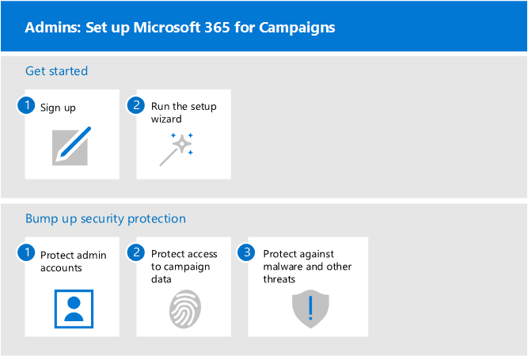
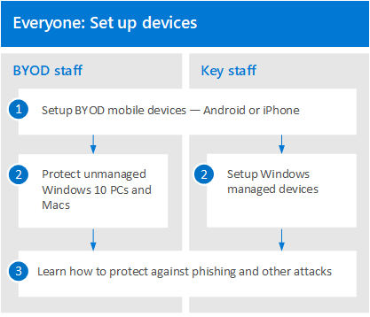

# Set up Microsoft 365 for Campaigns

This article describes the process of setting up Microsoft 365 for Campaigns.

## Admins: Set up Microsoft 365 for Campaigns
The following diagram describes how admins set up Microsoft 365 for Campaigns.

First you get started by [requesting an invite from Microsoft](https://m365forcampaigns.microsoft.com/), then [signing up for Microsoft 365 for Campaigns](m365-campaigns-sign-up.md). To complete setup [run the setup wizard](../business/set-up.md?toc=/microsoft-365/campaigns/toc.json) to configure the core settings.

Then you bump up security protection by: [protecting admin accounts](m365-campaigns-protect-admin-accounts.md), [increasing threat protection](m365-campaigns-increase-protection.md), and setting up [conditional access policies](m365-campaigns-conditional-access.md) and additional protection for [Windows 10 devices](../business/set-up-windows-devices.md?toc=/microsoft-365/campaigns/toc.json).

 ## Everyone: Set up your devices 
 
Users will need to take a few minutes to setup devices to work with this environment. For your key users (users who are the highest value targets for hackers), you can set up and pre-configure new devices, getting them ready for productive use as soon as a user signs in with their Microsoft 365 Business credentials. 

  
To set up user devices: 
1. Each user [sets up their mobile devices](../business/set-up-mobile-devices.md?toc=%2Fmicrosoft-365%2Fcampaigns%2Ftoc.json). 
2. For unmanaged devices, users set up their [PCs and Macs](m365-campaigns-protect-pcs-macs.md). 
For key staff, we recommend you use [managed devices](../business/set-up-windows-devices.md?toc=/microsoft-365/campaigns/toc.json) for even better protection. For all devices, you'll want to set up [multifactor authentication](m365-campaigns-multifactor-authenication.md). 
3. All users should learn how to protect themselves and your campaign by learning about [phishing and other attacks](m365-campaigns-phishing-and-attacks.md). This [infographic](m365-campaigns-protect-campaign-infographic.md) can also help your users understand how to help protect your campaign from online threats.

## Contact support

 **If you need to contact support:**
  
- Contact your partner.
    
- As a Microsoft 365 Business admin, you have access to our customer support team, **[Contact support for business products - Admin Help](https://support.office.com/article/32a17ca7-6fa0-4870-8a8d-e25ba4ccfd4b)**
    

