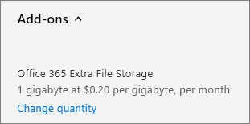

# Add storage space for your subscription

::: moniker range="o365-21vianet"

> [!NOTE]
> The admin center is changing. If your experience doesn't match the details presented here, see 
[About the new Microsoft 365 admin center](https://docs.microsoft.com/microsoft-365/admin/microsoft-365-admin-center-preview?view=o365-21vianet).

::: moniker-end

If you start to run out of storage for your SharePoint Online site collections, you can add storage to your subscription if your plan is eligible. If you don't see the **Office 365 Extra File Storage** in the list of available add-ons, it means your plan is not eligible. For more information, see [Is my plan eligible?](#is-my-plan-eligible-for-office-365-extra-file-storage)

> [!NOTE]
> If you bought your subscription through Volume Licensing or a CSP, you can't buy **Office 365 Extra File Storage** for your organization directly from Microsoft. Contact your representative or partner for help.

## Before you begin

You must be a Global or SharePoint admin to do the tasks in this article. For more information, see [About admin roles](../admin/add-users/about-admin-roles.md).

## View available storage

::: moniker range="o365-worldwide"

1. In the SharePoint admin center, go to the <a href="https://admin.microsoft.com/sharepoint?page=siteManagement&modern=true" target="_blank">Active sites</a> page, and sign in with an account that has [admin permissions](https://docs.microsoft.com/sharepoint/sharepoint-admin-role) for your organization.

2. In the upper right of the page, see the amount of storage used across all sites, and the total storage for your subscription. If your organization has configured Multi-Geo in Office 365, the bar also shows the amount of storage used across all geo locations.

   

   > [!NOTE]
   > The storage used doesn't include changes made within the last 24-48 hours.

::: moniker-end

::: moniker range="o365-germany"

1. Sign in to https://portal.office.de as a global or SharePoint admin, and then select the Admin tile to open the admin center. If you see a message that you don't have permission to access the page, it means that you don't have Microsoft 365 administrator permissions in your organization.

2. In the left pane, under **Admin centers**, select **SharePoint**. If the classic SharePoint admin center appears, select **Open it now** at the top of the page to open the new SharePoint admin center.

3. In the left pane of the new SharePoint admin center, select **Active sites**.

4. In the upper right of the page, see the amount of storage used across all sites, and the total storage for your subscription.

   

   > [!NOTE]
   > The storage used doesn't include changes made within the last 24-48 hours.

::: moniker-end

::: moniker range="o365-21vianet"

1. Sign in to https://login.partner.microsoftonline.cn/ as a global or SharePoint admin, and then select the Admin tile to open the admin center. (If you see a message that you don't have permission to access the page, it means that you don't have Microsoft 365 administrator permissions in your organization.

2. In the left pane, under **Admin centers**, select **SharePoint**. If the classic SharePoint admin center appears, select **Open it now** at the top of the page to open the new SharePoint admin center.

3. In the left pane of the new SharePoint admin center, select **Active sites**.

4. In the upper right of the page, see the amount of storage used across all sites, and the total storage for your subscription.  

   

   > [!NOTE]
   > The storage used doesn't include changes made within the last 24-48 hours.

::: moniker-end

After you've determined how much storage you're using, you can add or remove storage space for your subscription. To find out how much it will cost to add storage space, follow the steps in this article, and review the pricing information before you purchase.
  
For information about setting site collection storage limits, see [Manage site collection storage limits](https://docs.microsoft.com/sharepoint/manage-site-collection-storage-limits).
  
## Add storage to your subscription

If you haven't yet purchased extra storage for your subscription, you can do that.

::: moniker range="o365-worldwide"

1. In the admin center, go to the **Billing** \> <a href="https://go.microsoft.com/fwlink/p/?linkid=868433" target="_blank">Purchase services</a> page.
2. At the bottom of the **Purchase services** page, select **Add-ons**.
3. Select **Office 365 Extra File Storage**.
4. On the **Office 365 Extra File Storage** page, if shown, choose the base subscription, then enter the number of gigabytes of storage you want to add.
5. Select **Check out now**.
6. On the **How does this look?** page, verify the number of gigabytes of storage you selected, review the pricing information, and then select **Next**.
7. On the **Complete order** page, verify the total. If you need to make any changes, select **Edit order**. If the order requires a credit check, select the check box. When you're finished, select **Place order** \> **Go to Admin Home**.

::: moniker-end

::: moniker range="o365-germany"

1. In the admin center, go to the **Billing** \>  <a href="https://go.microsoft.com/fwlink/p/?linkid=847745" target="_blank">Subscriptions</a> page.

2. On the **Subscriptions** page, choose the subscription to which  you want to add storage space, then select **Add-ons**.

    
  
    > [!NOTE]
    > If you don't see **Add-ons**, and your subscription was purchased through a partner, select **Volume Licensing Service Center (VLSC)**.
  
3. Select **Buy add-ons**.

    
  
4. On the **Purchase services** page, mouse over or tap **Office 365 Extra File Storage**, then select **Buy now**.
  
5. Enter the number of user licenses that you need and, if shown, choose a base subscription. Select **Check out now**.
  
6. On the **How does this look?** page, verify the number of gigabytes of storage you selected, review the pricing information, and then select **Next**.

7. On the **Complete order** page, select **Place order**.

::: moniker-end

::: moniker range="o365-21vianet"

1. In the admin center, go to the **Billing** \> <a href="https://go.microsoft.com/fwlink/p/?linkid=850626" target="_blank">Subscriptions</a> page.

2. On the **Subscriptions** page, choose the subscription to which  you want to add storage space, then select **Add-ons**.

    
  
    > [!NOTE]
    > If you don't see **Add-ons**, and your subscription was purchased through a partner, select **Volume Licensing Service Center (VLSC)**.
  
3. Select **Buy add-ons**.

    
  
4. On the **Purchase services** page, mouse over or tap **Office 365 Extra File Storage**, then select **Buy now**.
  
5. Enter the number of user licenses that you need and, if shown, choose a base subscription. Select **Check out now**.
  
6. On the **How does this look?** page, verify the number of gigabytes of storage you selected, review the pricing information, and then select **Next**.

7. On the **Complete order** page, select **Place order**.

::: moniker-end

## Increase or decrease storage

If you have already purchased extra file storage via the **Office 365 Extra File Storage** add-on, you can use these steps to increase or decrease the extra storage space for your subscription. You can reduce the storage to as low as 1 gigabyte. To remove all of the extra storage space, [contact support](../admin/contact-support-for-business-products.md).

::: moniker range="o365-worldwide"

1. In the admin center, go to the **Billing** \> <a href="https://go.microsoft.com/fwlink/p/?linkid=842054" target="_blank">Your products</a> page.
2. On the **Products** tab, select the subscription that contains the **Office 365 Extra File Storage** add-on.
3. On the product details page, in the **Add-ons** section, select **Manage add-ons**.
4. In the **Manage add-ons** pane, from the **Add-on** list, choose **Office 365 Extra File Storage**.
5. In the **Quantity** text box, enter the number of GBs of storage space that you want for the subscription.
6. Select **Save**.

::: moniker-end

::: moniker range="o365-germany"

1. In the admin center, go to the **Billing** \> <a href="https://go.microsoft.com/fwlink/p/?linkid=847745" target="_blank">Subscriptions</a> page.

2. On the **Subscriptions** page, select **Add-ons**.

    
  
    > [!NOTE]
    > If you don't see **Add-ons**, and your subscription was purchased through a partner, select **Volume Licensing Service Center (VLSC)**.
  
3. Under **Office 365 Extra File Storage**, select **Change quantity**.

    
  
4. In the right pane, enter the total number of gigabytes that you need, then select **Submit**.

    For example, if you currently have 200 gigabytes of extra file storage but you only need 100 gigabytes, then you would enter **100** in the box.

5. Select **Close**.

::: moniker-end

::: moniker range="o365-21vianet"

1. In the admin center, go to the **Billing** \> <a href="https://go.microsoft.com/fwlink/p/?linkid=850626" target="_blank">Subscriptions</a> page.

2. On the **Subscriptions** page, select **Add-ons**.

    
  
    > [!NOTE]
    > If you don't see **Add-ons**, and your subscription was purchased through a partner, select **Volume Licensing Service Center (VLSC)**.
  
3. Under **Office 365 Extra File Storage**, select **Change quantity**.

    
  
4. In the right pane, enter the total number of gigabytes that you need, then select **Submit**.

    For example, if you currently have 200 gigabytes of extra file storage but you only need 100 gigabytes, then you would enter **100** in the box.

5. Select **Close**.

::: moniker-end

## Is my plan eligible for Office 365 Extra File Storage?

Office 365 Extra File Storage is available for the following subscriptions:
  
- Office 365 Enterprise E1

- Office 365 Enterprise E2

- Office 365 Enterprise E3

- Office 365 Enterprise E4

- Office 365 Enterprise E5

- Office for the web with SharePoint Plan 1

- Office for the web with SharePoint Plan 2

- SharePoint Online Plan 1

- SharePoint Online Plan 2

- Microsoft 365 Business Basic

- Microsoft 365 Business Standard

- Microsoft 365 Business Premium

- Microsoft 365 E3

- Microsoft 365 E5

- Microsoft 365 F1

> [!NOTE]
> Office 365 Extra File Storage is also available for GCC, GCC High, and DOD plans.

## Related content

[Manage site storage limits](ttps://docs.microsoft.com/sharepoint/manage-site-collection-storage-limits) (article)\
[Set the default storage space for OneDrive users](https://docs.microsoft.com/onedrive/set-default-storage-space)(article)
