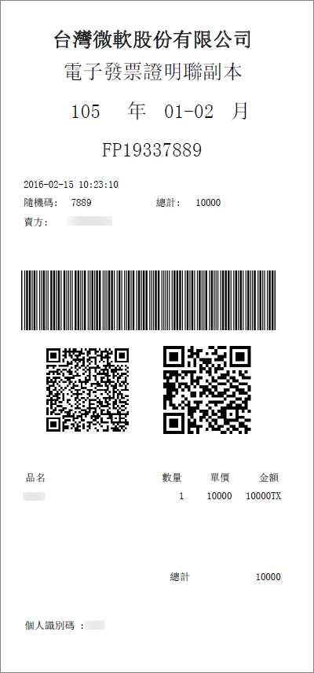

# Understand your e-Invoice for Microsoft 365 for business (Taiwan)

e-Invoice is electronic invoice issued by seller after buyer purchases in accordance with Taiwan Tax Authority's e-Invoice requirements. Information is transmitted to Taiwan Tax Authority's Electronic Invoice Cloud for record keeping. For Taiwan e-Invoice related information, please refer here: <a href="https://www.einvoice.nat.gov.tw/" target="_blank">財政部電子發票整合服務平台</a>
  
A sample copy of e-Invoice is included here:
  

  
## What is my tax rate?

For commercial purchases, we apply taxes in addition to the quoted price of our subscriptions at a rate prescribed by Taiwan Tax Authority. For any tax related questions or planning, please work with your tax advisor.
  
## When will e-Invoice start for my Microsoft 365 services?

Microsoft will replace current computerized invoice with e-Invoice on **September 15th**. For billing prior to September 15th, paper copy tax invoices are mailed directly to customers. After September 15th, e-Invoice will be offered in your Microsoft 365 admin center for view, download, and print, and will no longer be mailed directly to you. 
  
## Where can I find my e-Invoice?

You can view, download, and print your e-Invoice the day after your bill is ready, through your admin center, together with your monthly bill. [View your bill](view-your-bill-or-invoice.md).
  
## How do I update my VAT ID?

You can update your VAT ID at the time of onboarding, or through your admin center after you onboard.
  
At the time of account creation, in **Step 1**, Welcome, Let's get to know you, **page 2**, Where will you be using this?, below **Service Recipient Address** information, you can add your 8 digit **VAT ID**. If you do not have a VAT ID, please enter "00000000".
  
After you have created your account, you may update your VAT ID through your admin center by following these steps:
  
1. In the admin center, go to the **Billing** \> <a href="https://go.microsoft.com/fwlink/p/?linkid=842054" target="_blank">Your products</a> page.
    
2. Select a subscription, then select **More Actions**.
    
3. Select **Update Service Recipient Address**, and update **TAX ID** information. 
    
## How do I request an e-Invoice paper copy?

If your receipt won Lucky Draw (only available to customers without VAT ID), we will send a hard copy directly to the addresses on file by registered mail.
  
Otherwise, if you need the official paper copy of your e-Invoice, please [contact support](../../admin/contact-support-for-business-products.md). After we receive your request, we will mail the paper copy of the e-Invoice to the address on file.
  
## More questions?

[連絡客戶支援](../../admin/contact-support-for-business-products.md)