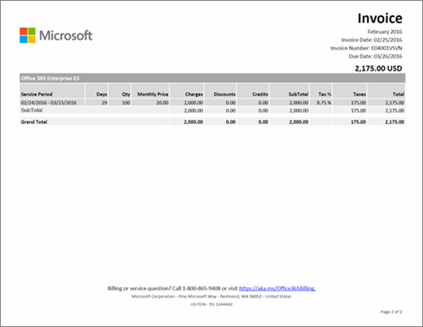

# Understand your bill or invoice for Microsoft 365 for business

> [!IMPORTANT]
> As of January 26, 2021, new bank accounts are no longer supported for customers in Belgium, France, Italy, Luxembourg, Portugal, Spain, and the United States. If you’re an existing customer in one of those countries, you can continue paying for your subscription with an existing bank account, and you can add new subscriptions to it, but only as long as the bank account is in good standing.

Either monthly or annually (depending on the option you chose when you purchased your subscription), you'll receive an email that tells you that your new billing statement is available in the admin center. [Learn how to find and view your bill or invoice](view-your-bill-or-invoice.md).
  
Your invoice contains two pages. Page 1 is the invoice summary, and contains general information about the invoice, order, amount due, how to make a payment, and how to contact support.
  

  
Page 2 contains details about the billing activity for each subscription.
  

  
For descriptions of the fields and terms included in your invoice, see the [Invoice Field Glossary](#invoice-field-glossary) later in this article.
  
## Understand billing concepts

Before you view your invoice, it's helpful to understand a few key billing concepts.
  
### Invoice balance vs. order balance

 **Invoice balance** is the amount shown on your invoice, and is only the amount due for that particular billing period. Your total **order balance** is the sum of all unpaid invoices. You can view your order balance in the **Billing** section of the admin center.
  
### Billing frequency vs. invoice frequency

 **Billing frequency** means how often you are billed. Subscriptions are billed either monthly or annually, depending on what option you chose during the subscription purchase. **Invoice frequency** means how often you receive an invoice. If you chose annual billing, you'll only receive one invoice per year, unless activity for your subscription requires a charge or a credit.
  
If you have more than one order, you'll receive an invoice for each order.
  
## Invoice Field Glossary

The following table describes the fields you might see on your invoice. Some fields listed here might not appear in your invoice, depending on whether you pay by invoice or by credit card or bank account.
  
> [!NOTE]
> Paying by bank account is not available in some countries or regions.
  
|**Name**|**Description**|
|:-----|:-----|
|Annual Price|Subscriptions are billed monthly or annually. If you chose annual billing during the subscription purchase, the annual license price is reflected on the invoice. If you want to change the billing frequency, you'll have to cancel your subscription and repurchase it with the new billing frequency.|
|Billing Period|Billing Period is the time period since the last invoice date. Service Period is the time period during which you are charged to use the service.|
|Bill-To|This is the address of your billing department, and is usually the same as the Sold-To address. To update your billing address, see [Change your billing addresses](change-your-billing-addresses.md).|
|Charges|Page 1 of your invoice summarizes all charges for the invoice Billing Period. Page 2 shows the detailed charges for each subscription.|
|Check|If you pay by invoice and check payment is offered in your country, the bottom of page 1 includes information about where to send your payment. Please reference the invoice number on your check.|
|Credits|Page 1 of your invoice summarizes all credits for the invoice Billing Period. Page 2 shows the detailed credits for each subscription.|
|Customer PO Number|Your Purchase Order (PO) number. If you update the PO number, future invoices will include it. [Change your purchase order number](#change-your-purchase-order-number).   **NOTE** You can't add a PO number to an existing invoice.           |
|Days|Each billing transaction is associated with a Service Period. The Days column indicates the number of days in that service period.|
|Discounts|Page 1 of your invoice summarizes all discounts for the invoice Billing Period. Page 2 shows the detailed discounts for each subscription.|
|Due Date|The date when payment is due for the invoice. If your subscription is paid with a credit card or bank account, we will charge your credit card or banking account the day after the Invoice Date.   **NOTE** Paying by bank account is not available in some countries or regions.           |
|Electronic Funds Transfer|If you chose "invoice" as the subscription payment method, page 1 contains the Microsoft bank account information for electronic (wire, ACH, SEPA, etc.) payments. Usually, your bank will have a reference field you complete when you send a payment. Please reference the invoice number shown in this field.|
|Grand Total|This row includes the totals for all Charges, Discounts, Credits, SubTotal, Tax, and Total columns for all subscriptions listed on the invoice.|
|Invoice Date|The date the invoice was created. The invoice date is the day after the end of your Billing Period. For example, if your Billing Period is Jan 15 - Feb 14, your Invoice Date is Feb 15.|
|Invoice Number|The unique number assigned to your invoice. Please reference the Invoice Number with your payment.|
|Monthly Price|Subscriptions are billed monthly or annually. If you chose monthly billing during the subscription purchase, the monthly license price is reflected on the invoice. If you want to change the billing frequency, you'll have to cancel your subscription and repurchase it with the new billing frequency.|
|Order Number|Every time you buy a new subscription, an order is created. Every month, you'll receive an invoice for each order.|
|Payment Instructions|If you pay by credit card, you'll see "Do not pay - charged to credit card on file." If you pay by invoice, you'll see instructions for paying by Electronic Funds Transfer (EFT) and check (if applicable).|
|Payment Terms|The number of days from the Invoice Date when payment is due. The standard is 30 days.|
|Product|On page 1 of your invoice, "Online Services" is the generic term used to describe your subscriptions. On page 2 , you'll see the individual subscription names.|
|QTY|The number of licenses purchased during the Service Period.|
|Service Period|Service Period is the time period during which you are charged to use the service. A Billing Period is the time period since the last invoice date.|
|Service Usage Address|The address where the service is being used, usually the same as your Sold-To address. To update your Service Usage Address, see [Change your billing addresses](change-your-billing-addresses.md).|
|Sold-To|Your company name and address. To update this information, see [Change your organization's address, technical contact email, and other information](../../admin/manage/change-address-contact-and-more.md).|
|SubTotal|Each subscription listed on your invoice has a separate SubTotal row for all Charges, Discounts, Credits, SubTotal, Tax, and Total columns for that subscription.|
|Tax|Page 1 of your invoice shows the total tax. Page 2 shows the tax rate applied, and the total tax amount for each line item. If your invoice contains taxes and your company is tax exempt, please [contact support](../../business-video/get-help-support.md).|
|Total|The amount due for the invoice Billing Period.|

## Change your purchase order number

If you pay by invoice, you can add or change the purchase order (PO) number for your subscription.
  
> [!NOTE]
> You can't add a PO number to an existing invoice. The PO number will appear on all future invoices.

::: moniker range="o365-worldwide"

1. In the admin center, go to the **Billing** \> <a href="https://go.microsoft.com/fwlink/p/?linkid=842054" target="_blank">Your products</a> page.

::: moniker-end

::: moniker range="o365-germany"

1. In the admin center, go to the **Billing** \> <a href="https://go.microsoft.com/fwlink/p/?linkid=847745" target="_blank">Your products</a> page.

::: moniker-end

::: moniker range="o365-21vianet"

1. In the admin center, go to the **Billing** \> <a href="https://go.microsoft.com/fwlink/p/?linkid=850626" target="_blank">Your products</a> page.

::: moniker-end

1. On the **Products** tab, select the subscription that you want to change.

1. On the subscription details page, in the **Subscription and payment settings** section, select **Edit invoice**.

1. At the bottom of the **Edit details for paying by voice** pane, enter your PO number, and then select **Save**.

## Related content

[Learn how to find and view your bill or invoice](view-your-bill-or-invoice.md) (article)\
[Change your billing addresses](change-your-billing-addresses.md) (article)\
[Change your organization's address, technical contact email, and other information](../../admin/manage/change-address-contact-and-more.md) (article)\
[Pay for your Microsoft 365 for business subscription](pay-for-your-subscription.md) (article)\
[Minecraft: Education Edition payment options](/education/windows/school-get-minecraft) (article)
