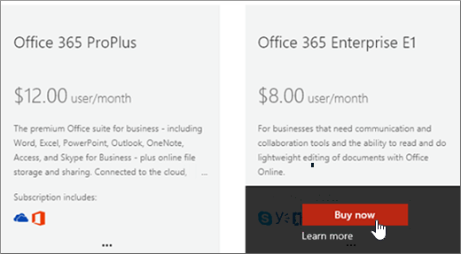

# Buy another Office 365 for business subscription

If you already have an Office 365 for business subscription and you want to buy another subscription for your organization, the best way is to do it is through the admin center. If you haven't yet purchased the first Office 365 for business subscription for your organization, go [here](https://products.office.com/business/compare-office-365-for-business-plans) to choose a plan.
  
When you buy another subscription through the admin center, you're guaranteed that the new subscription will be associated with the same organization (domain name space) as your existing subscription. This makes it easier to move users within your organization between subscriptions or assign them a user license for the additional subscription they need.
  
After purchasing a new subscription, you'll need to assign the users who you want to use that subscription a user license for it. To learn how, see [Assign licenses to users in Office 365 for business](../admin/manage/assign-licenses-to-users.md).
  
## Buy another subscription

::: moniker range="o365-worldwide"

1. In the admin center, go to the **Billing** \> <a href="https://go.microsoft.com/fwlink/p/?linkid=868433" target="_blank">Purchase services</a> page.

2. On the **Purchase services** page, select the subscription that you want to buy, then select **Buy**.

3. Enter the number of licenses that you need, and choose whether to pay each month or for the whole year. Choose whether you want to automatically assign licenses to everyone who does not currently have a license. Then select **Check out now**.

4. Your cart opens. If your cart disappears from the screen, select **Cart** to reopen it, review the order and then select **Check Out**.

5. Review the pricing information and select **Next**.

6. Provide your payment information, and then select **Place order** \> **Go to Admin Home**.

::: moniker-end

::: moniker range="o365-germany"

1. In the admin center, go to the **Billing** \> <a href="https://go.microsoft.com/fwlink/p/?linkid=847745" target="_blank">Subscriptions</a> page.

2. On the **Subscription** page, select **Add subscriptions**.

    You'll see the subscriptions that are available to your organization. Any subscriptions that you've already purchased are identified like this.

    
  
3. Mouse over or tap the subscription that you want to buy, and then select **Buy Now**.

    
  
4. Enter the number of user licenses you need, chose whether to pay each month or for the whole year, and then select **Add to Cart**.

5. Your cart opens. If your cart disappears from the screen, select **Cart** to reopen it, review the order and then select **Check Out**.

6. Review the pricing information and select **Next**.

7. Provide your payment information, and then select **Place order**.

8. On the confirmation page, select **Go to Admin Home**.

::: moniker-end

::: moniker range="o365-21vianet"

1. In the admin center, go to the **Billing** \> <a href="https://go.microsoft.com/fwlink/p/?linkid=850626" target="_blank">Subscriptions</a> page.

2. On the **Subscription** page, select **Add subscriptions**.

    You'll see the subscriptions that are available to your organization. Any subscriptions that you've already purchased are identified like this.

    
  
3. Mouse over or tap the subscription that you want to buy, and then select **Buy Now**.

    
  
4. Enter the number of user licenses you need, chose whether to pay each month or for the whole year, and then select **Add to Cart**.

5. Your cart opens. If your cart disappears from the screen, select **Cart** to reopen it, review the order and then select **Check Out**.

6. Review the pricing information and select **Next**.

7. Provide your payment information, and then select **Place order**.

8. On the confirmation page, select **Go to Admin Home**.

::: moniker-end

## Related articles

[Assign licenses to users](../admin/manage/assign-licenses-to-users.md)
  
[Remove licenses from users](../admin/manage/remove-licenses-from-users.md)